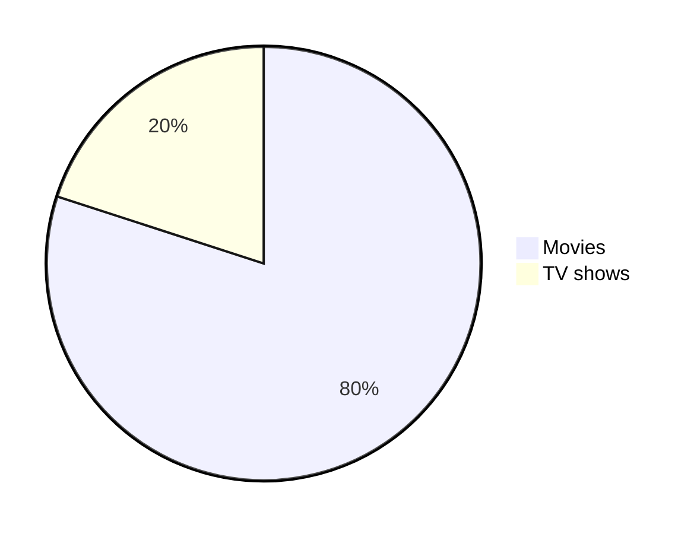

# markdown速查

主要[参考这里]()

- [Headings](#headings)
- [Text styles](#text-styles)
  - [Normal](#normal)
  - [Bold](#bold)
  - [Italic](#italic)
  - [Bold and Italic](#bold-and-italic)
  - [Blockquotes](#blockquotes)
  - [Monospaced](#monospaced)
  - [Underlined](#underlined)
  - [Strike-through](#strike-through)
  - [Boxed](#boxed)
  - [Subscript](#subscript)
  - [Superscript](#superscript)
  - [Text Color](#text-color)
  - [Multiline](#multiline)
- [Syntax Highlighting](#syntax-highlighting)
  - [Inline code](#inline-code)
  - [Code block](#code-block)
  - [Diff Code block](#diff-code-block)
- [Alignments](#alignments)
- [Tables](#tables)
- [Links](#links)
  - [Inline](#inline)
  - [Reference](#reference)
  - [Footnote](#footnote)
  - [Relative](#relative)
  - [Auto](#auto)
  - [Section](#section)
  - [Hover](#hover)
  - [Enclosed](#enclosed)
  - [Highlight words and link it to a URL](#highlight-words-and-link-it-to-a-url)
- [Images](#images)
  - [Theme](#theme)
    - [Using picture tag](#using-picture-tag)
    - [Using dark and light mode](#using-dark-and-light-mode)
- [Badges](#badges)
- [Lists](#lists)
  - [Ordered](#ordered)
  - [Unordered](#unordered)
  - [Task](#task)
- [Buttons](#buttons)
  - [Button with emoji](#button-with-emoji)
- [Collapsible items (28 July 2023)](#collapsible-items-28-july-2023)
- [Horizontal Rule](#horizontal-rule)
- [Diagrams (19 July 2022)](#diagrams-19-july-2022)
- [Mathematical expressions (19 July 2022)](#mathematical-expressions-19-july-2022)
- [Alerts (8 January 2024)](#alerts-8-january-2024)
- [Mention people and teams](#mention-people-and-teams)
- [Reference issues and pull requests](#reference-issues-and-pull-requests)
- [Color models](#color-models)
- [View Code](#view-code)
- [Code in titles](#code-in-titles)
- [Reference Labels](#reference-labels)
- [Miscellaneous](#miscellaneous)
  - [Comments](#comments)
  - [Escaping Markdown Characters](#escaping-markdown-characters)
  - [Emojis](#emojis)
  - [Line break](#line-break)
  - [Back to top](#back-to-top)
- [Bitbucket](#bitbucket)
- [Azure DevOps Project wiki](#azure-devops-project-wiki)
- [MDX](#mdx)
- [Tools](#tools)


# Headings

```md
# Heading 1
## Heading 2
### Heading 3
#### Heading 4
##### Heading 5
###### Heading 6
```
<!-- omit in toc -->
# Heading 1
<!-- omit in toc -->
## Heading 2
<!-- omit in toc -->
### Heading 3
<!-- omit in toc -->
#### Heading 4
<!-- omit in toc -->
##### Heading 5
<!-- omit in toc -->
###### Heading 6

```md
<h1>Heading 1</h1>
<h2>Heading 2</h2>
<h3>Heading 3</h3>
<h4>Heading 4</h4>
<h5>Heading 5</h5>
<h6>Heading 6</h6>
```

<!-- omit in toc -->
<h1>Heading 1</h1>
<!-- omit in toc -->
<h2>Heading 2</h2>
<!-- omit in toc -->
<h3>Heading 3</h3>
<!-- omit in toc -->
<h4>Heading 4</h4>
<!-- omit in toc -->
<h5>Heading 5</h5>
<!-- omit in toc -->
<h6>Heading 6</h6>


# Text styles

## Normal

```md
The quick brown fox jumps over the lazy dog.
```

The quick brown fox jumps over the lazy dog.

## Bold

Mac: <kbd>command+B</kbd>

Windows: <kbd>control+B</kbd>

```md
**The quick brown fox jumps over the lazy dog.**
__The quick brown fox jumps over the lazy dog.__
<strong>The quick brown fox jumps over the lazy dog.</strong>
```

**The quick brown fox jumps over the lazy dog.**

<!-- markdownlint-disable-next-line MD050 -->
__The quick brown fox jumps over the lazy dog.__

<strong>The quick brown fox jumps over the lazy dog.</strong>

## Italic

Mac: <kbd>command+I</kbd>

Windows: <kbd>control+I</kbd>

```md
*The quick brown fox jumps over the lazy dog.*
_The quick brown fox jumps over the lazy dog._
<em>The quick brown fox jumps over the lazy dog.</em>
```

*The quick brown fox jumps over the lazy dog.*

<!-- markdownlint-disable-next-line MD049 -->
_The quick brown fox jumps over the lazy dog._

<em>The quick brown fox jumps over the lazy dog.</em>

## Bold and Italic

```md
**_The quick brown fox jumps over the lazy dog._**
<strong><em>The quick brown fox jumps over the lazy dog.</em></strong>
```
<!-- markdownlint-disable-next-line MD049 -->
**_The quick brown fox jumps over the lazy dog._**

<strong><em>The quick brown fox jumps over the lazy dog.</em></strong>

## Blockquotes

Mac: <kbd>command+shift+.</kbd>

Windows: <kbd>control+shift+.</kbd>

```md
> The quick brown fox jumps over the lazy dog.

<br>

> The quick brown fox jumps over the lazy dog.
>
> The quick brown fox jumps over the lazy dog.
>
> The quick brown fox jumps over the lazy dog.

<br>

> The quick brown fox jumps over the lazy dog.
>> The quick brown fox jumps over the lazy dog.
>>> The quick brown fox jumps over the lazy dog.

<br>

> **The quick brown fox** *jumps over the lazy dog.*
```

> The quick brown fox jumps over the lazy dog.

<br>

> The quick brown fox jumps over the lazy dog.
>
> The quick brown fox jumps over the lazy dog.
>
> The quick brown fox jumps over the lazy dog.

<br>

> The quick brown fox jumps over the lazy dog.
>> The quick brown fox jumps over the lazy dog.
>>> The quick brown fox jumps over the lazy dog.

<br>

> **The quick brown fox** *jumps over the lazy dog.*

## Monospaced

```md
<samp>The quick brown fox jumps over the lazy dog.</samp>
```

<samp>The quick brown fox jumps over the lazy dog.</samp>

## Underlined

```md
<ins>The quick brown fox jumps over the lazy dog.</ins>
```

<ins>The quick brown fox jumps over the lazy dog.</ins>

## Strike-through

```md
~~The quick brown fox jumps over the lazy dog.~~
```

~~The quick brown fox jumps over the lazy dog.~~

```md
<pre>
Lorem ipsum dolor sit amet, consectetur adipiscing elit. <strike>Sed do eiusmod tempor incididunt ut labore et dolore magna
aliqua.</strike> Ut enim ad minim veniam, quis nostrud exercitation ullamco laboris nisi ut aliquip ex ea commodo consequat.
Duis aute irure dolor in reprehenderit in voluptate velit esse cillum dolore eu fugiat nulla pariatur. <strike>Excepteur sint
occaecat cupidatat non proident, sunt in culpa qui officia deserunt mollit anim id est laborum.</strike>
</pre>
```

<pre>
Lorem ipsum dolor sit amet, consectetur adipiscing elit. <strike>Sed do eiusmod tempor incididunt ut labore et dolore magna
aliqua.</strike> Ut enim ad minim veniam, quis nostrud exercitation ullamco laboris nisi ut aliquip ex ea commodo consequat.
Duis aute irure dolor in reprehenderit in voluptate velit esse cillum dolore eu fugiat nulla pariatur. <strike>Excepteur sint
occaecat cupidatat non proident, sunt in culpa qui officia deserunt mollit anim id est laborum.</strike>
</pre>

````md
<strike>

```js
console.log('Error');
```

</strike>
````

<strike>

```js
console.log('Error');
```

</strike>

## Boxed

```md
<table><tr><td>The quick brown fox jumps over the lazy dog.</td></tr></table>
```

<table><tr><td>The quick brown fox jumps over the lazy dog.</td></tr></table>

## Subscript

```md
log<sub>2</sub>(x)
Subscript <sub>The quick brown fox jumps over the lazy dog.</sub>
```

log<sub>2</sub>(x)

Subscript <sub>The quick brown fox jumps over the lazy dog.</sub>

## Superscript

```md
2 <sup>53-1</sup> and -2 <sup>53-1</sup>
Superscript <sup>The quick brown fox jumps over the lazy dog.</sup>
```

2 <sup>53-1</sup> and -2 <sup>53-1</sup>

Superscript <sup>The quick brown fox jumps over the lazy dog.</sup>


## Multiline

The quick\
brown fox\
jumps over\
the lazy dog.

```md
The quick\
brown fox\
jumps over\
the lazy dog.
```

# Syntax Highlighting

## Inline code

A class method is an instance method of the class object. When a new class is created, an object of type `Class` is initialized and assigned to a global constant (Mobile in this case).

You can use <kbd>command + e </kbd> on Mac or <kbd>control + e</kbd> on Windows to insert inline code.

## Code block

<!-- markdownlint-disable MD040 -->

```
public static String monthNames[] = {"January", "February", "March", "April", "May", "June", "July", "August", "September", "October", "November", "December"};
```

<!-- markdownlint-enable MD040 -->

````md
```
public static String monthNames[] = {"January", "February", "March", "April", "May", "June", "July", "August", "September", "October", "November", "December"};
```
````

```java
public static String monthNames[] = {"January", "February", "March", "April", "May", "June", "July", "August", "September", "October", "November", "December"};
```

````md
```java
public static String monthNames[] = {"January", "February", "March", "April", "May", "June", "July", "August", "September", "October", "November", "December"};
```
````

Refer to [this](https://github.com/github-linguist/linguist/blob/master/lib/linguist/languages.yml) and [this](https://github.com/github-linguist/linguist/tree/master/vendor) GitHub document to find all the valid keywords.

## Diff Code block

```diff
## git diff a/test.txt b/test.txt
diff --git a/a/test.txt b/b/test.txt
index 309ee57..c995021 100644
--- a/a/test.txt
+++ b/b/test.txt
@@ -1,8 +1,6 @@
-The quick brown fox jumps over the lazy dog
+The quick brown fox jumps over the lazy cat

 a
-b
 c
 d
-e
 f
```

````md
```diff
## git diff a/test.txt b/test.txt
diff --git a/a/test.txt b/b/test.txt
index 309ee57..c995021 100644
--- a/a/test.txt
+++ b/b/test.txt
@@ -1,8 +1,6 @@
-The quick brown fox jumps over the lazy dog
+The quick brown fox jumps over the lazy cat

 a
-b
 c
 d
-e
 f
```
````

```diff
- Text in Red
+ Text in Green
! Text in Orange
# Text in Gray
@@ Text in Purple and bold @@
```

````md
```diff
- Text in Red
+ Text in Green
! Text in Orange
# Text in Gray
@@ Text in Purple and bold @@
```
````

# Alignments

```md
<p align="left">

</p>
```

<p align="left">
<!-- markdownlint-disable-next-line MD013 -->

</p>

```md
<p align="center">

</p>
```

<p align="center">
<!-- markdownlint-disable-next-line MD013 -->

</p>

```md
<p align="right">

</p>
```

<p align="right">
<!-- markdownlint-disable-next-line MD013 -->

</p>

```md
<h3 align="center"> My latest Medium posts </h3>
```

<!-- omit in toc -->
<h3 align="center"> My latest Medium posts </h3>

# Tables

```md
<table>
<tr>
<td width="33%"">
The quick brown fox jumps over the lazy dog.
</td>
<td width="33%">
The quick brown fox jumps over the lazy dog.
</td>
<td width="33%">
The quick brown fox jumps over the lazy dog.
</td>
</tr>
</table>
```

<table>
<tr>
<td width="33%"">
The quick brown fox jumps over the lazy dog.
</td>
<td width="33%">
The quick brown fox jumps over the lazy dog.
</td>
<td width="33%">
The quick brown fox jumps over the lazy dog.
</td>
</tr>
</table>

```md
| Default | Left align | Center align | Right align |
| - | :- | :-: | -: |
| 9999999999 | 9999999999 | 9999999999 | 9999999999 |
| 999999999 | 999999999 | 999999999 | 999999999 |
| 99999999 | 99999999 | 99999999 | 99999999 |
| 9999999 | 9999999 | 9999999 | 9999999 |

| Default    | Left align | Center align | Right align |
| ---------- | :--------- | :----------: | ----------: |
| 9999999999 | 9999999999 | 9999999999   | 9999999999  |
| 999999999  | 999999999  | 999999999    | 999999999   |
| 99999999   | 99999999   | 99999999     | 99999999    |
| 9999999    | 9999999    | 9999999      | 9999999     |

Default    | Left align | Center align | Right align
---------- | :--------- | :----------: | ----------:
9999999999 | 9999999999 | 9999999999   | 9999999999
999999999  | 999999999  | 999999999    | 999999999
99999999   | 99999999   | 99999999     | 99999999
9999999    | 9999999    | 9999999      | 9999999
```

| Default | Left align | Center align | Right align |
| - | :- | :-: | -: |
| 9999999999 | 9999999999 | 9999999999 | 9999999999 |
| 999999999 | 999999999 | 999999999 | 999999999 |
| 99999999 | 99999999 | 99999999 | 99999999 |
| 9999999 | 9999999 | 9999999 | 9999999 |

| Default    | Left align | Center align | Right align |
| ---------- | :--------- | :----------: | ----------: |
| 9999999999 | 9999999999 | 9999999999   | 9999999999  |
| 999999999  | 999999999  | 999999999    | 999999999   |
| 99999999   | 99999999   | 99999999     | 99999999    |
| 9999999    | 9999999    | 9999999      | 9999999     |

<!-- markdownlint-disable MD055 -->
Default    | Left align | Center align | Right align
---------- | :--------- | :----------: | ----------:
9999999999 | 9999999999 | 9999999999   | 9999999999
999999999  | 999999999  | 999999999    | 999999999
99999999   | 99999999   | 99999999     | 99999999
9999999    | 9999999    | 9999999      | 9999999
<!-- markdownlint-enable MD055 -->

```md
<table>
<tr>
<th>Heading 1</th>
<th>Heading 2</th>
</tr>
<tr>

<td>

| A | B | C |
|--|--|--|
| 1 | 2 | 3 |

</td><td>

| A | B | C |
|--|--|--|
| 1 | 2 | 3 |

</td></tr> </table>
```

<table>
<tr>
<th>Heading 1</th>
<th>Heading 2</th>
</tr>
<tr>

<td>

| A | B | C |
|--|--|--|
| 1 | 2 | 3 |

</td><td>

| A | B | C |
|--|--|--|
| 1 | 2 | 3 |

</td></tr> </table>

```md
| A | B | C |
|---|---|---|
| 1 | 2 | 3 <br/> 4 <br/> 5 |
```

| A | B | C |
|---|---|---|
| 1 | 2 | 3 <br/> 4 <br/> 5 |

```md
<table>
<tr>
<th>Before Hoisting</th>
<th>After Hoisting</th>
</tr>
<tr>
<td>
<pre lang="js">
console.log(fullName); // undefined
fullName = "Dariana Trahan";
console.log(fullName); // Dariana Trahan
var fullName;
</pre>
</td>
<td>
<pre lang="js">
var fullName;
console.log(fullName); // undefined
fullName = "Dariana Trahan";
console.log(fullName); // Dariana Trahan
</pre>
</td>
</tr>
</table>
```

<table>
<tr>
<th>Before Hoisting</th>
<th>After Hoisting</th>
</tr>
<tr>
<td>
<pre lang="js">
console.log(fullName); // undefined
fullName = "Dariana Trahan";
console.log(fullName); // Dariana Trahan
var fullName;
</pre>
</td>
<td>
<pre lang="js">
var fullName;
console.log(fullName); // undefined
fullName = "Dariana Trahan";
console.log(fullName); // Dariana Trahan
</pre>
</td>
</tr>
</table>

# Links

## Inline

```md
[The-Ultimate-Markdown-Cheat-Sheet](https://github.com/lifeparticle/Markdown-Cheatsheet)
```

[The-Ultimate-Markdown-Cheat-Sheet](https://github.com/lifeparticle/The-Ultimate-Markdown-Cheat-Sheet)

## Reference

```md
[The-Ultimate-Markdown-Cheat-Sheet][reference text]

[The-Ultimate-Markdown-Cheat-Sheet][1]

[Markdown-Cheat-Sheet]

[reference text]: https://github.com/lifeparticle/Markdown-Cheatsheet
[1]: https://github.com/lifeparticle/Markdown-Cheatsheet
[Markdown-Cheat-Sheet]: https://github.com/lifeparticle/Markdown-Cheatsheet
```

[The-Ultimate-Markdown-Cheat-Sheet][reference text]

[The-Ultimate-Markdown-Cheat-Sheet][1]

[Markdown-Cheat-Sheet]

[reference text]: https://github.com/lifeparticle/The-Ultimate-Markdown-Cheat-Sheet
[1]: https://github.com/lifeparticle/The-Ultimate-Markdown-Cheat-Sheet
[Markdown-Cheat-Sheet]: https://github.com/lifeparticle/The-Ultimate-Markdown-Cheat-Sheet

## Footnote

Footnote.[^1]

Some other important footnote.[^2]

[^1]: This is footnote number one.
[^2]: Here is the second footnote.

```md
Footnote.[^1]

Some other important footnote.[^2]

[^1]: This is footnote number one.
[^2]: Here is the second footnote.
```


## Relative

```md
[Example of a relative link](rl.md)
```

[Example of a relative link](rl.md)

## Auto

```md
Visit https://github.com/
```

Visit https://github.com/

```md
Email at example@example.com
```

Email at example@example.com

## Section


## Hover

You can use [BinaryTree](https://binarytree.dev/ "Array of Developer Productivity Tools Designed to Help You Save Time") to create markdown tables.

<!-- markdownlint-disable MD051 -->
You can use [BinaryTree](## "Array of Developer Productivity Tools Designed to Help You Save Time") to create markdown tables.

## Enclosed

```md
<https://github.com/>
```

<https://github.com/>

## Highlight words and link it to a URL

```md
[BinaryTree](https://binarytree.dev/)
```

[BinaryTree](https://binarytree.dev/)


# Images

Alt text and title are optional.

```md

```


```md
![alt text][image]

[image]: https://images.unsplash.com/photo-1415604934674-561df9abf539?ixlib=rb-1.2.1&ixid=eyJhcHBfaWQiOjEyMDd9&auto=format&fit=crop&w=100&q=80 "Title text"
```

![alt text][image]

[image]: https://images.unsplash.com/photo-1415604934674-561df9abf539?ixlib=rb-1.2.1&ixid=eyJhcHBfaWQiOjEyMDd9&auto=format&fit=crop&w=100&q=80 "Title text"

```md

```

<!-- markdownlint-disable-next-line MD013 -->


```md

```


```md

```

[](https://binarytree.dev/)

```md
[](https://binarytree.dev/)
```

<!-- markdownlint-disable-next-line MD013 -->
<a href='https://binarytree.dev/' target='_blank'>  </a>

```md
<a href='https://binarytree.dev/' target='_blank'>  </a>
```

# Lists

## Ordered

Mac: <kbd>command+shift+7</kbd>

Windows: <kbd>control+shift+7</kbd>

```md
1. One
2. Two
3. Three
```

1. One
2. Two
3. Three

```md
1. First level
    1. Second level
        - Third level
            - Fourth level
2. First level
    1. Second level
3. First level
    1. Second level
```

1. First level
    1. Second level
        - Third level
            - Fourth level
2. First level
    1. Second level
3. First level
    1. Second level

## Unordered

Mac: <kbd>command+shift+8</kbd>

Windows: <kbd>control+shift+8</kbd>

```md
* 1
* 2
* 3

+ 1
+ 2
+ 3


- 1
- 2
- 3
```

<!-- markdownlint-disable MD004 -->

* 1
* 2
* 3

+ 1
+ 2
+ 3

<!-- markdownlint-enable MD004 -->

- 1
- 2
- 3

```md
- First level
  - Second level
    - Third level
      - Fourth level
- First level
  - Second level
- First level
  - Second level
```

- First level
  - Second level
    - Third level
      - Fourth level
- First level
  - Second level
- First level
  - Second level

```md
<ul>
<li>First item</li>
<li>Second item</li>
<li>Third item</li>
<li>Fourth item</li>
</ul>
```

<ul>
<li>First item</li>
<li>Second item</li>
<li>Third item</li>
<li>Fourth item</li>
</ul>

## Task

```md
- [x] Fix Bug 223
- [ ] Add Feature 33
- [ ] Add unit tests
```

- [x] Fix Bug 223
- [ ] Add Feature 33
- [ ] Add unit tests

# Buttons

```md
<kbd>cmd + shift + p</kbd>
```

<kbd>cmd + shift + p</kbd>

```md
<kbd> <br> cmd + shift + p <br> </kbd>
```

<kbd> <br> cmd + shift + p <br> </kbd>

```md
<kbd>[Markdown-Cheatsheet](https://github.com/lifeparticle/Markdown-Cheatsheet)</kbd>
```

<kbd>[Markdown-Cheatsheet](https://github.com/lifeparticle/Markdown-Cheatsheet)</kbd>

```md
[<kbd>Markdown-Cheatsheet</kbd>](https://github.com/lifeparticle/Markdown-Cheatsheet)
```

[<kbd>Markdown-Cheatsheet</kbd>](https://github.com/lifeparticle/Markdown-Cheatsheet)

## Button with emoji

<!-- markdownlint-disable-next-line MD013 -->
<kbd> <br> [Markdown-Cheatsheet](https://github.com/lifeparticle/Markdown-Cheatsheet) ↗️ <br> </kbd>

```md
<kbd> <br> [Markdown-Cheatsheet](https://github.com/lifeparticle/Markdown-Cheatsheet) <br> </kbd>
```


# Diagrams (19 July 2022)

````md

````


# Mathematical expressions (19 July 2022)

> [!IMPORTANT]
> Check out the official documentation on [GitHub](https://docs.github.com/en/get-started/writing-on-github/working-with-advanced-formatting/writing-mathematical-expressions) to learn more about writing and formatting MathJax syntax.

```md
This is an inline math expression $x = {-b \pm \sqrt{b^2-4ac} \over 2a}$
```

This is an inline math expression $x = {-b \pm \sqrt{b^2-4ac} \over 2a}$

```md
$$
x = {-b \pm \sqrt{b^2-4ac} \over 2a}
$$
```

$$
x = {-b \pm \sqrt{b^2-4ac} \over 2a}
$$


<!--stackedit_data:
eyJoaXN0b3J5IjpbLTk5NDI1NDM4NiwxNzA5MTM2NzkyXX0=
-->