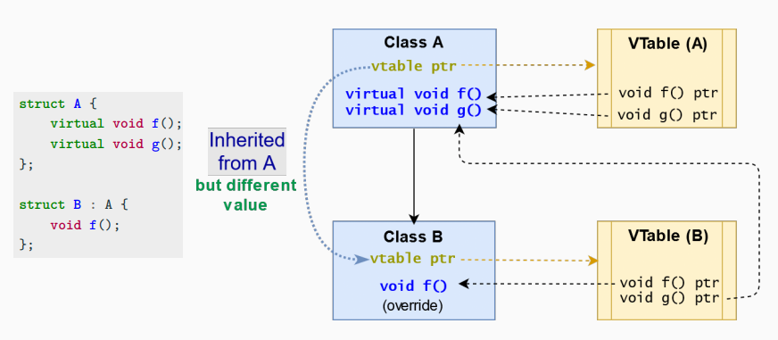

# 面向对象编程

object-oriented programming

## `class`

在 C++ 中，结构体（struct）和类（class）在语义上是等价的。然而，应使用这两个关键字来区分不同的语义：

-   `struct` 代表被动 (passive) 对象，即物理状态（数据集）。使用 `struct` 关键字通常意味着该类型主要用于存储数据，没有太多复杂的行为。这是一种更接近于传统 C 语言的结构体的用法，适用于表示简单的数据结构。
-   `class` 代表主动 (active) 对象，即逻辑状态（数据抽象）。使用 `class` 关键字则意味着该类型不仅包含数据，还可能包括与这些数据相关的复杂行为。类更倾向于封装和数据抽象，适用于实现更复杂的逻辑。
-  在 `struct` 中，默认的成员访问权限是公开（public），这意味着结构体的成员在任何地方都可以直接访问。
-   在 `class` 中，默认的成员访问权限是私有（private），这意味着类的成员只能被类本身的方法或特定的友元（friend）访问。

`class` 的 member 分为两类:
* 数据成员 (data member). 类中的数据被称为数据成员或类字段
* 函数成员 (function member). 类中的函数被称为函数成员或方法

### RAII: Resource Acquisition is Initialization

- 资源的持有是类不变量，与对象生命周期紧密相关。这意味着一旦一个类的对象被创建，它就会持有某些资源（如文件句柄、数据库连接等），并且这些资源会一直被持有直到对象的生命周期结束。这是通过在类的构造函数中分配资源，并在析构函数中释放资源来实现的。
- RAII（资源获取即初始化）习惯法包括三个步骤：
  - 将资源封装进一个类（构造函数）
  - 通过类的本地实例使用资源
  - 当对象超出作用域时，资源会自动释放（析构函数）
- 影响1：C++ 编程语言不需要垃圾收集器！由于RAII保证了资源的及时释放，C++程序通常不需要垃圾收集器来管理内存或其他资源的回收，这与依赖垃圾收集器的语言（如Java）不同。
- 影响2：程序员有责任管理资源。虽然RAII提供了自动资源管理的机制，但程序员仍需在设计和实现类时确保正确使用RAII原则。错误的资源管理或误用RAII可能导致资源泄露、无效的资源引用等问题。

### `struct`/`class` 的声明

- 结构体声明与定义
```c++
struct A; // 结构体声明  
struct A { // 结构体定义
  int x; // 数据成员
  void f(); // 函数成员
};
```

- 类声明与定义
```c++
class A;  // 类声明
class A { // 类定义
  int x; // 数据成员
  void f(); // 函数成员
};
```

```c++
struct A {
  void g(); // 函数成员声明
  void f() { // 函数成员定义
    cout << "f"; // 内联定义
  }
};
void A::g() { // 函数成员定义
    cout << "g"; // 外部定义
 }
```

```cpp
struct B {
  void g() { cout << "g"; } // 函数成员定义
};
struct A {
  int x; // 数据成员
  B b; // 数据成员，类型为结构体B
  void f() { cout << "f"; } // 函数成员定义
};
A a; // 创建A类型的对象a
a.x; // 访问数据成员x
a.f(); // 调用成员函数f()
a.b.g(); // 访问成员对象b的成员函数g()
```

### 类的层次 (class hierarchy)

- 子类/派生类 (child/derived class or subclass)
  - 从另一个类继承变量和函数的新类被称为派生类或子类。

- 父类/基类 (parent/base class)
  - 为派生类提供变量和功能的最近的类被称为父类或基类。

- 扩展基类
  - 指创建一个新类，保留基类的特性，并在此基础上可以添加（而不能删除）自己的成员。

- 语法
```c++
    class DerivedClass : [<继承属性 (inheritance attribute)>] BaseClass {
    }
```

```cpp
struct A { // 基类
    int value = 3;
    void g() {}
};
struct B : A { // B 是 A 的派生类（B 继承 A）
    int data = 4; // B 继承自 A
    int f() { return data; }
};
A a;
B b;
a.value; // 访问 A 类的成员变量
b.g(); // 调用继承自 A 类的方法
```
```cpp
struct A {};
struct B : A {};
void f(A a) {} // 通过值传递
void g(B b) {} // 通过值传递
void f_ref(A& a) {} // 引用传递，适用于 A 类型和其子类对象
void g_ref(B& b) {} // 引用传递，适用于 B 类型和其子类对象
A a;
B b;
f(a); // 正确，也可以 f(b), f_ref(a), g_ref(b)
g(b); // 正确，也可以 g_ref(b), 但不可以 g(a), g_ref(a)
A a1 = b; // 正确，也可以 A& a2 = b
// 当派生类对象赋值给基类对象时，只有派生类对象中的基类部分被复制到基类对象中。这个过程通常称为对象的“切片”（slicing），因为派生类特有的属性被“切掉”了，只剩下基类的部分。
// B b1 = a; // 编译错误，因为 A 类型不能隐式转换为 B 类型
```

### 访问控制符/访问说明符 (access specifiers)

访问说明符定义了继承类成员的可见性。关键字 public、private 和 protected 指定了可见性区域。
访问说明符的目的是为了防止直接访问类的内部表示，以避免错误使用和潜在的不一致性（访问控制）。
- public：没有限制（函数成员、派生类、类外部）
- protected：函数成员和派生类访问
- private：仅限函数成员访问（内部）
结构体默认为公有成员
**类默认为私有成员，私有继承**

```c++
struct A1 {
    int value; // 公有（默认）
protected:
    void f1() {} // 受保护
private:
    void f2() {} // 私有
};
class A2 {
    int data; // 私有（默认）
};
struct B : A1 {
    void h1() { f1(); } // 正确，"f1" 在 B 中可见
    // void h2() { f2(); } // 编译错误，"f2" 在 A1 中为私有
};
A1 a;
a.value; // 正确
// a.f1() // 编译错误，受保护
// a.f2() // 编译错误，私有
```

访问控制符也用于定义，在继承中从基类到特定派生类的可见性如何传播。

| Member <br> declaration |  | Inheritance |  | Derived classes |
| :---: | :---: | :---: | :---: | :---: |
| public <br> protected <br> private | $\rightarrow$ | public | $\rightarrow$ | public <br> protected |
| public <br> protected <br> private | $\rightarrow$ | protected | $\rightarrow$ | protected <br> protected |
| public <br> protected <br> private | $\rightarrow$ | private | $\rightarrow$ | private <br> private |

* `struct` 默认是公有继承
```cpp
struct A {
    int var1; // 公有
protected:
    int var2; // 受保护
};
struct B : protected A {
    int var3; // 公有
};
B b;
// b.var1; // 编译错误，var1 在 B 中为受保护
// b.var2; // 编译错误，var2 在 B 中为受保护
b.var3; // 正确，var3 在 B 中为公有
```

* `class` 默认是私有继承
```cpp
class A {
public:
    int var1; // 公有
protected:
    int var2; // 受保护
};
class B1 : A {}; // 私有继承
class B2 : public A {}; // 公有继承
B1 b1;
// b1.var1; // 编译错误，var1 在 B1 中为私有
// b1.var2; // 编译错误，var2 在 B1 中为私有
B2 b2;
b2.var1; // 正确，var1 在 B2 中为公有
```

### 构造函数 `class constructor`


构造函数 [constructor, ctor]
构造函数是类的一种特殊成员函数，当创建类的新实例时执行。
目标：初始化和资源获取
语法：`T(...)` 与类名相同且无返回类型
- 构造函数应该初始化所有数据成员
- 我们可以定义具有不同签名的多个构造函数
- 任何构造函数都可以是 constexpr


#### 默认构造函数

default constructor
默认构造函数 `T()` 是一个**无参数的构造函数**
每个类总是具有隐式的 (implicit)、显式的 (explicit) 或删除的 (explicit) 默认构造函数之一
```c++
struct A {
    A() {} // 显式的默认构造函数
    A(int) {} // 用户定义的（非默认）构造函数
};
```
在 C++ 中，在定义函数或构造函数的参数时，如果参数名在函数体内未被使用，你可以选择不给这个参数命名。这种做法常见于以下情况：

1.  **函数声明中**：在声明函数或构造函数时，常常只需要指定参数类型而不是参数名。这主要是为了说明函数的接口，不关心参数的具体名称。
2.  **函数定义中**：如果函数实现不需要使用某个参数，那么可以省略该参数的名称。这有助于避免编译器警告关于未使用变量的信息，同时也使得函数定义更简洁。


```cpp
struct A {
    int x = 3; // 隐式的默认构造函数
};
A a{}; // 调用默认构造函数，等价于：A a;
```

注意：一个隐式的默认构造函数是 constexpr
注意，`A a2();` 语句实际上会被解释为一个函数声明，这是一个常见的错误，称为“最令人疑惑的 C++ 解析”。

**直接列表初始化**： - 使用 `{}`（C++11 引入的直接列表初始化）可以调用默认构造函数。这种语法更加明确，可以避免与函数声明混淆。 - 在创建数组或使用 `new` 关键字动态分配数组时，每个元素都将通过默认构造函数进行初始化。


一个类的隐式默认构造函数会被标记为删除 (`deleted`)，如果：
- 它有任何用户定义的构造函数
```cpp
struct A {
    A(int x) {}
};
// A a; // 编译错误
```

-   它有非静态成员/基类是引用或常量类型
```cpp
struct NoDefault { // 删除的默认构造函数
    int& x;
    const int y;
};
```

* 它有一个非静态成员/基类，其自身的默认构造函数被删除（或不可访问）
```cpp
struct A {
    NoDefault var; // 删除的默认构造函数
};
struct B : NoDefault {}; // 删除的默认构造函数
```

* 它有一个非静态成员/基类，其析构函数被删除或不可访问
```cpp
struct A {
private:
    ∼A() {}
};
```

#### 初始化列表 (initializer list)

初始化列表用于初始化类的数据成员，或在进入构造函数体之前显式调用基类的构造函数（不要与 std::initializer_list 混淆）
```cpp
struct A {
    int x, y;
    A(int x1) : x(x1) {} // ": x(x1)" 是初始化列表
    // 直接初始化语法
    A(int x1, int y1) : // ": x{x1}, y{y1}"
    x{x1}, // 是初始化列表
    y{y1} {} // 直接列表初始化语法
}; // (C++11)
```


C++11 中的类内非静态数据成员初始化（In-class non-static data members initialization, NSDMI）允许在声明数据成员的地方初始化它们。用户定义的构造函数可以用来覆盖这些默认值。
```cpp
struct A {
    int x = 0; // 类内成员初始化器
    const char* str = nullptr; // 类内成员初始化器
    A() {} // 如果调用默认构造函数，“x”和“str”都将被良好定义
    A(const char* str1) : str{str1} {}
};
```


常量和引用数据成员必须使用初始化列表, 或 C++11 的类内大括号, 或等号初始化器语法进行初始化
```cpp
struct A {
    int x;
    const char y; // 必须初始化
    int& z; // 必须初始化
    int& v = x; // 等号初始化器（C++11）, equal-initializer
    const int w{4}; // 大括号初始化器（C++11）
    A() : x(3), y('a'), z(x) {}
};
```

类成员的初始化顺序遵循声明的顺序，而不是初始化列表中的顺序。在 C++ 中，类成员的初始化顺序并不由构造函数中初始化列表的顺序决定，而是由成员在类中声明的顺序决定。这意味着，即使在初始化列表中先初始化某个成员，如果它在类定义中的声明顺序在另一个成员之后，它实际上会在那个成员之后被初始化。
```cpp
struct ArrayWrapper {
    int* array;
    int size;
    ArrayWrapper(int user_size) :
    size{user_size},
    array{new int[size]} {} // 错误！！：“size” 还未定义
};
ArrayWrapper a(10);
cout << a.array[4]; // 段错误
```

#### 列表初始化 (统一初始化, uniform initialization)

统一初始化（C++11）
统一初始化 `{}`，也称为列表初始化，是一种完全独立于数据类型的方式来初始化任何对象
- 最小化冗余的类型名
  - 在函数参数中
  - 在函数返回中
- 解决“最令人困惑的解析”问题 (most vexing parse problem)
  - 构造函数被解释为函数原型
 
```cpp
struct Point {
    int x, y;
    Point(int x1, int y1) : x(x1), y(y1) {}
};
// C++03 版本的 add 函数
Point add(Point a, Point b) {
    return Point(a.x + b.x, a.y + b.y);
}
Point c = add(Point(1, 2), Point(3, 4));

// C++11 版本的 add 函数
Point add(Point a, Point b) {
    return { a.x + b.x, a.y + b.y }; // 使用列表初始化返回
}
auto c = add({1, 2}, {3, 4}); // 使用列表初始化构造参数
```

* “最令人困惑的解析”问题 (most vexing parse problem)
```cpp
struct A {
A(int) {}
};
struct B {
// A a(1); // compile error It works in a function scope
A a{2}; // ok, call the constructor
};
```

```cpp
struct A {};
struct B {
B(A a) {}
void f() {}
};
B b( A() ); // "b" is interpreted as function declaration
			// with a single argument A (*)() (func. pointer)
// b.f() // compile error "Most Vexing Parse" problem
		 // solved with B b{ A{} };
```

#### 构造函数的继承


类构造函数永远不会被继承。派生类必须定义自己的构造函数。
派生类必须在当前类构造函数之前隐式或显式地调用基类构造函数
类构造函数的调用顺序是从最顶层的基类开始，一直到最派生的类（C++对象的构建像洋葱一样层层递进）
```cpp
struct A {
    A() { cout << "A"; }
};
struct B1 : A { // 隐式调用 "A()"
    int y = 3; // 然后, "y = 3"
};
struct B2 : A { // 显式调用 "A()"
//派生自 `A`，但在其构造函数中显式地调用了 `A` 的构造函数，然后执行自己的额外逻辑（打印 "B"）。
    B2() : A() { cout << "B"; }
};
B1 b1; // 打印 "A"
B2 b2; // 打印 "A", 然后打印 "B"
```

#### 委托构造函数 (delegate constructor)


问题描述：
大多数构造函数在执行个别操作之前通常会执行相同的初始化步骤。
C++11 中的委托构造函数通过调用同一类的另一个构造函数来减少重复代码，从而添加一个执行所有初始化步骤的函数。
```cpp
struct A {
    int a;
    float b;
    bool c;
    // 标准构造函数：
    A(int a1, float b1, bool c1) : a(a1), b(b1), c(c1) {
        // 执行大量工作
    }
    A(int a1, float b1) : A(a1, b1, false) {} // 委托构造函数
    A(float b1) : A(100, b1, false) {} // 委托构造函数
};
```

#### `explicit`


关键字 `explicit` 指定一个构造函数或转换操作符（conversion operator, C++11）不允许从单一参数或花括号初始化器进行隐式转换或复制初始化，用于防止构造函数或类型转换操作符进行不希望的隐式类型转换

```cpp
struct MyString {
    MyString(int n); // （1）为字符串分配 n 字节
    MyString(const char *p); // （2）从原始字符串初始化
};
MyString string = 'a'; // 调用（1），隐式转换！
// explicit 不能应用于复制/移动构造函数

struct A {
    A() {}
    A(int) {}
    A(int, int) {}
};
void f(const A&) {}
A a1 = {}; // 正常
A a2(2); // 正常
A a3 = 1; // 正常（隐式）
A a4{4, 5}; // 正常。选择 A(int, int)
A a5 = {4, 5}; // 正常。选择 A(int, int)
f({}); // 正常
f(1); // 正常
f({1}); // 正常
```

```cpp
struct B {
    explicit B() {}
    explicit B(int) {}
    explicit B(int, int) {}
};
void f(const B&) {}
// B b1 = {}; // 错误，隐式转换
B b2(2); // 正常
// B b3 = 1; // 错误，隐式转换
B b4{4, 5}; // 正常。选择 B(int, int)
// B b5 = {4, 5}; // 错误，隐式转换
B b6 = (B) 1; // 正常：显式转换
// f({}); // 错误，隐式转换
// f(1); // 错误，隐式转换
// f({1}); // 错误，隐式转换
f(B{1}); // 正常
```


#### 拷贝构造函数

拷贝构造函数 (copy constructor) `T(const T&)` 创建一个新对象，作为现有对象的深拷贝。深拷贝意味着复制的是对象内容及其指向的所有数据，而不仅仅是指针。
```cpp
struct A {
    A() {} // 默认构造函数
    A(int) {} // 非默认构造函数
    A(const A&) {} // 拷贝构造函数 → 直接初始化
}
```

拷贝构造函数细节
- 每个类总是定义一个隐式或显式的拷贝构造函数
- 拷贝构造函数隐式地调用基类的默认构造函数
- 拷贝构造函数总被认为是用户定义的构造函数
- 拷贝构造函数不具有模板参数，否则它就是一个标准成员函数
- 拷贝构造函数不应与赋值运算符 operator= 混淆

```cpp
MyStruct x;
MyStruct y{x}; // 拷贝构造函数
y = x; // 调用赋值运算符=，而非拷贝构造函数。这叫 copy initialization
```

```cpp
struct Array {
    int size;
    int* array;
    Array(int size1) : size{size1} {
        array = new int[size];
    }
    // 拷贝构造函数，初始化列表 ": size{obj.size}"
    Array(const Array& obj) : size{obj.size} {
        array = new int[size];
        for (int i = 0; i < size; i++)
            array[i] = obj.array[i];
    }
};
Array x{100}; // 对 x.array 进行操作...
Array y{x}; // 调用 "Array::Array(const Array&)"
```

拷贝构造函数用于：
-   从另一个同类型的对象初始化一个对象
    -   直接构造
    -   赋值运算符
- 将对象作为函数的按值传递的输入参数进行复制
- 将对象作为从函数返回的结果进行复制
```cpp
A a1;
A a2(a1); // 直接复制初始化
A a3{a1}; // 直接复制初始化
A a4 = a1; // 复制初始化。注意，这里调用的是拷贝构造函数，而不是 operator=, 赋值运算符用于已经存在的对象之间的赋值操作，例如：`a4 = a1;`（注意这里 `a4` 已经被定义和初始化过了）。
A a5 = {a1}; // 复制列表初始化
// 将对象作为函数的按值传递的输入参数进行复制
void f(A a);
// 将对象作为从函数返回的结果进行复制
A f() { return A(3); } 

```

```cpp
struct A {
    A() {}
    A(const A& obj) { cout << "copy"; }
};
void f(A a) {} // 按值传递
A g1(A& a) { return a; }
A g2() { return A(); }
A a;
A b = a; // 拷贝构造函数（赋值）"copy"
A c(b); // 拷贝构造函数（直接）"copy"
f(b); // 拷贝构造函数（参数）"copy"
g1(a); // 拷贝构造函数（返回值）"copy"
A d = g2(); 
```

一个类的隐式拷贝构造函数被标记为删除的简化情况：
- 它具有非静态成员/基类为引用或常量类型
```cpp
struct NonDefault { int& x; }; // 删除的拷贝构造函数
```

* 它具有一个非静态成员/基类，其拷贝构造函数被删除（或不可访问）
```cpp
struct B { // 删除的拷贝构造函数
    NonDefault a;
};
struct B : NonDefault {}; // 删除拷贝构造函数
```
-   它的非静态成员/基类具有被删除或不可访问的析构函数
-   该类具有移动构造函数


### 析构函数

析构函数 [destructor, dtor]
析构函数是一种特殊的成员函数，它在对象超出作用范围或对该类的指针应用 `delete/delete[]` 表达式时执行。
目标：资源释放
语法：`∼T()` 与类名相同且无返回类型
- 任何对象都有一个析构函数，总是隐式或显式声明的
- C++20 析构函数可以是 constexpr

```cpp
struct Array {
    int* array;
    Array() { // 构造函数
        array = new int[10];
    }
    ∼Array() { // 析构函数
        delete[] array;
    }
};
int main() {
    Array a; // 调用构造函数
    for (int i = 0; i < 5; i++)
        Array b; // 循环5次调用构造函数和析构函数
} // 调用"a"的析构函数
```

* 类的析构函数从不被继承，每个类都需要定义自己的析构函数，即使这个析构函数只是简单地调用基类的析构函数。基类的析构函数在当前类的析构函数之后调用
* 类的析构函数调用顺序是相反的，从最派生的类到最顶层的基类
```cpp
struct A {
    ∼A() { cout << "A"; }
};
struct B {
    ∼B() { cout << "B"; }
};
struct C : A {
    B b; // 调用 ∼B()
    ∼C() { cout << "C"; }
};
int main() {
    C b; // 输出 "C"，然后是 "B"，最后是 "A"
}
```


### `=default`


在 C++11 中，`= default` 关键字的引入使得开发者能够明确要求编译器为类生成标准的特殊成员函数，如构造函数、析构函数和赋值操作符
- 默认/拷贝/移动构造函数。
```cpp
A() = default;
A(const A&) = default;
A(A&&) = default;
```
 - 析构函数
```cpp
∼A() = default;
```
- 拷贝/移动赋值操作符
```cpp
A& operator=(const A&) = default;
A& operator=(A&&) = default;
```
- 空间船操作符 (spaceship operator)
```cpp
auto operator<=>(const A&) const = default;
```
`= default` 暗示了 constexpr，但并非 noexcept 或 explicit。

`= default`提供了几个优点：
* 可以通过在类定义中使用 `= default` 来更改特殊成员函数的可见性，例如，可以将移动构造函数设为 `protected`，以限制其使用。
*  在某些情况下，如果定义了其他构造函数，编译器不会自动生成默认构造函数。使用 `= default` 可以确保即使在定义了其他构造函数后，类仍然有一个默认构造函数。
*  默认的特殊成员函数通常是 `constexpr`，使得它们可能在编译时就被计算，从而提高效率。注意，虽然默认函数是 `constexpr`，但并非自动 `noexcept` 或 `explicit`，这些特性需要显式指定。

```cpp
struct A {
	A(int v1) {} // delete implicitly-defined default ctor because
				 // a user-provided constructor is defined
	A() = default; // now, A has the default constructor
};
```

```cpp
struct B {
protected:
	B() = default; // now it is protected
};
```

```cpp
struct C {
	int x;
	// C() {} // 'x' is undefined
	C() = default; // 'x' is zero
}; 
```


## class 关键字

### `this`

`this` 指针: 每个对象都可以通过 `this` 指针访问自己的地址。
显式使用 this 指针并非强制性的（也不推荐）。
使用 this 指针是必要的当：
- 局部变量的名称与某个成员名称相同
- 返回对调用对象的引用
```cpp
struct A {
    int x;
    void f(int x) {
        this->x = x; // 没有 "this" 则不起作用
    }
    const A& g() {
        return *this;
    }
};
```


### `static`


`static` 关键字声明的成员（字段或方法）不绑定到类实例。一个 static 成员由**该类的所有对象共享**。

```cpp
struct A {
    int x;
    int f() { return x; } // 实例方法，可以访问实例成员
    static int g() { return 3; } // 静态方法，不可以访问实例成员 'x'
};
A a{4};
a.f(); // 调用类实例方法
A::g(); // 调用静态类方法
a.g(); // 类实例也可以访问静态类成员
```


```cpp
struct A {
    static const int a = 4; // C++03
    static constexpr float b = 4.2f; // 更好，C++11
    // static const float c = 4.2f; // 仅限 GNU 扩展 (GCC)
    static constexpr int f() { return 1; } // ok, C++11
    // static const int g() { return 1; } // 'const' 指的是返回类型
};
```


在 C++17 之前，非 const 静态数据成员不能直接在行内初始化

```cpp
struct A {
    // static int a = 4; // 编译错误
    static int a; // ok, 仅声明
    static inline int b = 4; // C++17 起 ok. 
    // 对于 `static` 成员变量，`inline` 的使用允许在其声明中直接进行初始化，无需在类外部单独定义。这简化了多文件项目中的管理，因为不需要在一个源文件中单独定义该静态成员。
    static int f() { return 2; }
    static int g(); // ok, 仅声明
};
int A::a = 4; // ok, 没有这个定义将引起未定义引用错误
int A::g() { return 3; } // ok, 没有这个定义将引起未定义引用错误
```

```cpp
struct A {
    static int x; // 声明
    static int f() { return x; }
    static int& g() { return x; }
};
int A::x = 3; // 定义
// ---------------------------------------------------------------------------------
A::f(); // 返回 3
A::x++;
A::f(); // 返回 4
A::g() = 7;
A::f(); // 返回 7
```


静态成员函数只能访问静态类成员

非静态成员函数可以访问静态类成员

```cpp
struct A {
    int x = 3;
    static inline int y = 4;
    int f1() { return x; } // ok
    // static int f2() { return x; } // 编译错误，'x' 不可见
    int g1() { return y; } // ok
    static int g2() { return y; } // ok
    struct B {
        int h() { return y + g2(); } // ok
    }; // 'x', 'f1()', 'g1()' 在 'B' 内不可见
};
```

### `const`


常量成员函数 （检查器或观察器, inspectors or observers）是那些带有 const 标记的函数，它们不允许改变对象的逻辑状态。

常量成员函数，是一个重要的 C++ 特性 ，用于增强类型安全和防止对象在不应该的上下文中被修改。通过在成员函数声明的末尾加上 `const` 关键字，方法中的所有数据成员都被标记为 const，包括 this 指针，可以保证这个函数不会修改类的任何成员变量（除了被声明为 `mutable` 的成员）。
- 没有 const 后缀的成员函数称为非常量成员函数或变更器/修改器 (mutators/modifiers)

```cpp
struct A {
    int x = 3;
    int* p;
    int get() const {
        // x = 2; // 编译错误，类变量不能被修改
        // p = nullptr; // 编译错误，类变量不能被修改
        p[0] = 3; // 可行，p 是 'int* const' -> 其内容不受保护
        return x;
    }
};
```

当常量成员函数用于强制执行 const 正确性时，尤其是在访问指针时，非常有用。

- 常量和非常量重载：可以为同一个类实现常量和非常量版本的成员函数，使得当对象是常量时，只能调用常量版本，这个版本不允许修改对象；而当对象不是常量时，可以调用非常量版本，允许修改对象。
const 关键字是函数签名的一部分。因此，一个类可以实现两个类似的方法，一个用于 const 对象，一个用于非 const 对象：


```cpp
class A {
    int x = 3;
public:
    int& get1() { return x; } // 读写
    int get1() const { return x; } // 只读
    int& get2() { return x; } // 读写
};
A a1;
cout << a1.get1(); // ok
cout << a1.get2(); // ok
a1.get1() = 4; // ok
const A a2;
cout << a2.get1(); // ok
// cout << a2.get2(); // 编译错误 "a2" 是 const
// a2.get1() = 5; // 编译错误 只有 "get1() const" 可用
```
const 对象只能调用 const 成员函数，非 const 对象可以调用 const 成员函数和非 const 成员函数。

### `mutable`


在 const 类实例中，`mutable` **数据成员**是可以修改的。它们应该是对象的物理状态 (实际值) 的一部分，而不是逻辑状态 (不随值变化的接口对外提供的功能) 的一部分。
- 如果大部分成员应该是常量但有少数需要修改时，这非常有用。
- 从概念上讲，mutable 成员不应改变任何可以从类接口检索到的内容。

```cpp
struct A {
    int x = 3;
    mutable int y = 5;
};
const A a;
// a.x = 3; // 编译错误，因为 const
a.y = 5; // 可以修改，因为 mutable
```

在上述代码中，`a` 是一个 const 对象，这通常意味着不能修改它的任何数据成员。然而，由于成员 `y` 被声明为 `mutable`，即使 `a` 是 const，`y` 也可以被修改。这显示了 `mutable` 关键字如何允许对 const 对象的某些部分进行修改，而不影响整个对象的常量性。

当一个对象被声明为 `const`，比如 `const A a;`，这意味着以下内容无法改变：

-   成员变量：该对象的所有非 `mutable` 成员变量不能被修改。任何尝试修改这些成员变量的操作都会导致编译错误。
    
-   成员函数：只能调用该对象的 `const` 成员函数。这些函数保证不会修改对象的状态（除了 `mutable` 成员变量）。

### `using`

using 关键字用于在特定类中声明类型别名
```cpp
struct A {
    using type = int;
};
typename A::type x = 3; // 使用 "typename" 关键字是因为我们在引用类型
struct B : A {};
typename B::type x = 4; // B 可以使用 "type" 因为它在 A 中是公开的
```

using 关键字也可以用来改变成员数据或函数的继承属性

```cpp
struct A {
    protected:
    int x = 3;
};
struct B : A {
    public:
    using A::x;
};
B b;
b.x = 3; // ok, "b.x" 现在是公开的
```

### `friend`

友元类 (friend class) 可以访问在其中被声明为友元的类的 `private` 和 `protected` 成员。
友元关系的属性：
- 不对称：如果类 A 是类 B 的友元，类 B 不自动成为类 A 的友元。
- 不可传递：如果类 A 是类 B 的友元，类 B 是类 C 的友元，类 A 不自动成为类 C 的友元。
- 不可继承：如果基类 Base 是类 X 的友元，派生类 Derived 不自动成为类 X 的友元；如果类 X 是基类 Base 的友元，类 X 也不自动成为派生类 Derived 的友元。

```cpp
class B; // 类声明
class A {
    friend class B;
    int x; // 私有成员
};
class B {
    int f(A a) { return a.x; } // 可行，B 是 A 的友元
};
class C : public B {
    // int f(A a) { return a.x; } // 编译错误，友元关系不可继承
};
```


非成员函数如果被声明为某个类的友元，可以访问该类的 private 和 protected 成员。
```cpp
class A {
    int x = 3; // 私有成员
    friend int f(A a); // 声明友元关系，无实现
};
// 'f' 不是任何类的成员函数
int f(A a) {
    return a.x; // f 是 A 的友元函数
}
```

友元方法通常用于实现流操作符 operator `<<` 等功能。

### `delte`


`delete` 关键字用于显式地标记一个成员函数为删除的，任何尝试使用它的操作都将导致编译错误。当它用于拷贝/移动构造函数或赋值操作时，可以防止编译器隐式生成这些函数。
类的默认拷贝/移动函数可能会产生意外的结果。使用 `delete` 关键字可以防止这些错误。
```cpp
struct A {
    A() = default;
    A(const A&) = delete; // 例如，因为不安全或昂贵而删除
};
void f(A a) {} // 隐式调用拷贝构造函数
A a;
// f(a); // 编译错误，因为已标记为删除
```


## 多态 (polymorphism)

在面向对象编程（OOP）中，多态性（polymorphism, 意为“具有多种形式”）是指对象能够根据具体的使用上下文改变其行为的能力。

### 动态多态性: virtual function
动态多态性通过虚函数（virtual function）实现，这使得子类可以重写（override）基类中的虚函数方法。在运行时，根据对象的实际类型（而非引用或指针的类型）来决定调用哪个方法。这种行为称为晚绑定（late binding）或运行时绑定（runtime binding）。

- 使用 `virtual` 关键字声明基类的函数时，意味着派生类可以并且可能会改写这个方法。
- 使用 `override` 关键字在派生类中声明方法时，强调这个方法是对基类虚函数的一个重写。

```cpp
class Base {
public:
    virtual void display() const { std::cout << "Base display"; }
};

class Derived : public Base {
public:
    void display() const override { std::cout << "Derived display"; }
};

int main() {
    Base* b = new Derived();
    b->display();  // 输出 "Derived display"
    delete b;
}
```
### 静态多态性: overloading

重载 (`overloading`) 是静态多态（编译时多态）的一种形式 

静态多态性（也称为编译时多态性）通过函数重载实现。函数重载允许同一作用域内存在多个同名函数，只要它们的参数列表不同即可。编译器会根据调用时提供的参数类型决定调用哪个函数。

- 编译器根据调用函数时提供的参数类型和数量在编译时解析应该调用哪个函数，这种绑定称为早绑定（early binding）。

在 C++ 中，多态一词通常与动态多态（覆盖）紧密关联。

```cpp
void f(int a) {}
void f(double b) {}
f(3);   // 调用 f(int)
f(3.3); // 调用 f(double)
```


函数绑定 (function binding) 是将函数调用连接到函数体的过程。
- 在早期绑定 (early binding) 或静态绑定 (static binding) 或编译时绑定 (compile-time binding) 中，编译器在编译时确定对象的类型：
  - 程序可以直接跳转到函数地址。
- 在晚期绑定 (late binding) 或动态绑定 (dynamic binding) 或运行时绑定 (run-time binding) 中，运行时在执行时确定对象的类型，然后将函数调用与正确的函数定义匹配：
  - 程序必须读取指针中保存的地址，然后跳转到那个地址（由于涉及额外的间接级别，效率较低）。
- C++ 通过声明虚函数实现晚期绑定。


在 C++ 中，当不使用虚函数时，函数调用在编译时就已确定其绑定关系，即使在继承结构中重写了函数。这称为早期绑定或静态绑定。

```cpp
struct A {
    void f() { cout << "A"; }
};
struct B : A {
    void f() { cout << "B"; }
};
void g(A& a) { a.f(); } // 接受 A 和 B
void h(B& b) { b.f(); } // 仅接受 B
A a;
B b;
g(a); // 输出 "A"
g(b); // 输出 "A"，而不是 "B"！！！
```

使用虚函数后，函数调用的解析将推迟到运行时，这使得根据对象的实际类型调用相应的函数成为可能。这称为晚期绑定或动态绑定。

```cpp
struct A {
    virtual void f() { cout << "A"; } // "f()" 现在是虚函数，运行时求值
};
struct B : A {
    void f() { cout << "B"; } // "B::f()" 覆盖了 "A::f()"，运行时求值
};
void g(A& a) { a.f(); } // 接受 A 和 B
A a;
B b;
g(a); // 输出 "A"
g(b); // 现在，输出 "B"！！！
```


在 C++ 中，虚函数允许基于对象的实际类型来调用相应的方法，这是通过虚函数表（通常称为 vtable）来实现的。当通过引用或指针调用虚函数时，将使用动态绑定来决定应调用哪个方法。然而，如果通过值调用，将使用静态绑定，即调用基类的方法。

```cpp
struct A {
    virtual void f() { cout << "A"; }
};
struct B : A {
    void f() { cout << "B"; }
};

// 使用引用调用虚函数
void f(A& a) { a.f(); } // 输出 "B"，动态绑定

// 使用指针调用虚函数
void g(A* a) { a->f(); } // 输出 "B"，动态绑定

// 通过值调用虚函数
void h(A a) { a.f(); } // 输出 "A"，静态绑定
B b;
f(b); // 输出 "B"
g(&b); // 输出 "B"
h(b); // 输出 "A"（对象被切片为 A 类型）
```

```cpp
struct A {
    virtual void f() { cout << "A"; }
};
struct B : A {
    void f() { cout << "B"; }
};

// 根据布尔值返回 A 类型或 B 类型的对象
A* get_object(bool selectA) {
    return (selectA) ? new A() : new B();
}
get_object(true)->f();  // 输出 "A"
get_object(false)->f(); // 输出 "B"
```


虚拟表（vtable）是一个用于解析函数调用并支持动态派发（晚期绑定）的函数查找表。
虚拟表包含了可以由类的对象调用的每个虚函数的一个条目。这个表中的每个条目简单地是一个函数指针，指向该类可访问的最派生函数。
编译器为基类添加了一个隐藏的指针，该指针指向该类的虚拟表（sizeof 计算时考虑了 vtable 指针）。




### `override`

`override` 关键字用来确保一个函数是虚拟的，并且重写了基类中的一个虚函数。它迫使编译器检查基类以确定是否存在具有完全相同签名的虚函数。 `override` 关键字确保声明的函数确实是重写基类中已有的虚函数。如果没有在基类中找到一个完全匹配的虚函数签名来重写，则会出现编译错误。这里的关键是函数签名必须完全相同，包括函数的参数类型、数量、const 修饰符等。

使用 `override` 关键字时，可以省略 `virtual` 关键字，因为 `override` 已经隐含了虚函数的性质。

```cpp
struct A {
    virtual void f(int a); // 将 "float" 值强制转换为 "int"
};
struct B : A {
    void f(int a) override; // 正确
    void f(float a); // （仍然）非常危险！！
    // void f(float a) override; // 编译错误，不安全
    // void f(int a) const override; // 编译错误，不安全
};
// f(3.3f) 在 A 和 B 之间的行为不同
```

当通过基类的指针或引用调用虚函数时，通常**会执行最派生类中的函数版本**，这是因为 C++ 的多态性和虚函数的动态绑定机制。然而，还有一些特殊情况和细节需要注意：

1.  **最派生类的实现**：如果派生类中提供了虚函数的具体实现（即覆盖了基类中的虚函数），则实际运行时，无论何时通过基类的指针或引用调用该函数，都会执行派生类中的版本。
    
2.  **基类调用**：尽管通常情况下会调用最派生类的实现，但派生类内部可以通过特定的语法显式调用基类的虚函数。例如，派生类可以在其覆盖的虚函数中使用 `Base::functionName()` 语法来调用基类版本的虚函数。
    
3.  **未覆盖的虚函数**：如果派生类没有覆盖基类中的某个虚函数，那么通过派生类的对象调用该虚函数时，将执行基类中的实现。

### `final`


`final` 关键字用于防止类被继承，或派生类中的方法被覆盖。
- 在方法上使用 `final` 表示该方法不能在派生类中被进一步覆盖。
- 在类上使用 `final` 表示该类不能被继承。


```cpp
struct A {
    virtual void f(int a) final; // 使用 "final"，此方法不可被覆盖
};
struct B : A {
    // void f(int a); // 编译错误：因为 A 中的 f(int) 已标记为 "final"
    void f(float a); // 可能造成危险（仍然可行）
};

struct C final { // 标记为 "final"，不可被继承
};
// struct D : C { // 编译错误：因为 C 已标记为 "final"，不能被继承
// };
```


* 在 C++ 中，如果一个类有至少一个虚函数，它应该声明一个虚析构函数 (virtual destructor)。这是为了确保通过基类指针删除派生类对象时，能够正确调用派生类的析构函数，避免资源泄露。


```cpp
struct A {
    ~A() { cout << "A"; } // 问题在这里（没有声明为虚）
    virtual void f(int a) {}
};
struct B : A {
    int* array;
    B() { array = new int[1000000]; } // 分配大量内存
    ~B() { delete[] array; } // 释放内存
};

// ---------------------------------------------------------------------
void destroy(A* a) {
    delete a; // 调用 ~A()
}
B* b = new B;
destroy(b); // 没有虚析构函数，~B() 不会被调用
// destroy() 只打印 "A" -> 导致巨大内存泄露
```

如果派生类分配了资源（如动态内存、文件句柄等），而基类的析构函数不是虚的，那么通过基类指针删除派生类对象时，只会调用基类的析构函数。这可能导致派生类分配的资源没有被正确释放，从而造成资源泄漏。

为了解决这个问题，应将基类 `A` 的析构函数声明为虚：
```cpp
struct A {
    virtual ~A() { cout << "A"; }
};
```
这样，无论何时通过基类指针删除对象，都会首先调用派生类的析构函数，然后再调用基类的析构函数，从而保证所有资源都被正确管理和释放。


* 在构造函数中调用虚拟方法是不安全的，因为派生类在构造函数完成前还没有完全准备好。在析构函数中调用虚拟方法也是不安全的，因为派生类在进入基类析构函数之前已经被销毁。

```cpp
struct A {
    A() { f(); } // 在此调用虚拟方法，实际调用的是 A::f()，因为 B 还没准备好
    virtual void f() { cout << "Explosion"; }
};
struct B : A {
    B() = default; // 调用 A 的构造函数。注意：A 的构造函数可能也是隐式的
    void f() override { cout << "Safe"; }
};
B b; // 调用 B()，输出 "Explosion"，而不是 "Safe"!!
```


* 避免在虚拟方法中使用默认参数
默认参数在虚拟方法中不是继承的。这意味着派生类中重写的方法不会继承基类中该方法的默认参数值。

### 示例代码和解释
```cpp
struct A {
    virtual void f(int i = 5) { cout << "A::" << i << "\n"; }
    virtual void g(int i = 5) { cout << "A::" << i << "\n"; }
};
struct B : A {
    void f(int i = 3) override { cout << "B::" << i << "\n"; }
    void g(int i) override { cout << "B::" << i << "\n"; }
};
A a; B b;
a.f(); // 输出 "A::5"
b.f(); // 输出 "B::3"
A& ab = b;
ab.f(); // 输出 "B::5"，因为 ab 被视为 A 类型，使用 A 中的默认参数
ab.g(); // 输出 "B::5"，虽然 g 在 B 中被覆盖，但 A 中的默认参数仍然被使用
```

默认参数的值是在编译时静态绑定的，即它们与函数调用的静态类型（声明的类型）相关联，而不是对象的动态类型（运行时类型）。


### 纯虚函数 (pure virtual method)


纯虚函数是一种必须在派生类中实现的函数（具体实现）。纯虚函数可以有也可以没有函数体。

### 示例代码和解释
```cpp
struct A {
    virtual void f() = 0; // 纯虚函数，没有函数体
    virtual void g() = 0; // 纯虚函数，可以有函数体
};
void A::g() {} // 为 g 提供纯虚函数的实现（函数体）

struct B : A {
    void f() override {} // 必须实现
    void g() override {} // 必须实现
};
```
* 包含至少一个纯虚函数的类不能被实例化
```cpp
struct A {
    virtual void f() = 0;
};
struct B1 : A {
    // virtual void f() = 0; // 隐式声明为纯虚
};
struct B2 : A {
    void f() override {}
};
// A a; // "A" 有一个纯虚函数，不能被实例化
// B1 b1; // "B1" 有一个纯虚函数，不能被实例化
B2 b2; // 可以实例化
```

-   **接口** (interface)：如果一个**类仅包含纯虚函数**，并且建议（可选）有一个虚析构函数，这样的类称为接口。接口不包含实现或数据。
-   **抽象类**：如果一个**类至少有一个纯虚函数**，则该类为抽象类。

```cpp
struct A { // 接口
    virtual ~A(); // 建议实现虚析构函数
    virtual void f() = 0;
};
struct B { // 抽象类
    B() {} // 抽象类可以有构造函数
    virtual void g() = 0; // 至少一个纯虚函数
protected:
    int x; // 附加数据
};
```


### 类转换 class casting

类转换 (class-casting) 允许在类的层次结构中隐式或显式地将一个类转换为另一个类。

* 上转型（Upcasting）
上转型是指从派生类的引用或指针转换为基类的引用或指针。
	- 可以是隐式的，也可以是显式的
	- 这种转换是安全的
	- 可以使用 static_cast 或 dynamic_cast 实现

* 下转型（Downcasting）
下转型是指从基类的引用或指针转换为派生类的引用或指针。
	- 只能显式进行
	- 这种转换可能是危险的
	- 可以使用 static_cast 或 dynamic_cast 实现

*  侧转型（Sidecasting，又称 Cross-cast）
侧转型是指在同一层级的不同类之间的引用或指针转换。
	- 只能显式进行
	- 这种转换可能是危险的
	- 只能使用 dynamic_cast 实现


* 示例 1：上转型和下转型

```cpp
struct A {
    virtual void f() { cout << "A"; }
};
struct B : A {
    int var = 3;
    void f() override { cout << "B"; }
};
A a;
B b;
A& a1 = b; // 隐式上转型
static_cast<A&>(b).f(); // 输出 "B"，上转型
static_cast<B&>(a).f(); // 输出 "A"，错误的下转型，但可能不抛出异常
cout << b.var; // 输出 3，无需转型
cout << static_cast<B&>(a).var; // 可能导致段错误，错误的下转型
```
* 示例 2：侧转型（Cross-cast）
```cpp
struct A {
    virtual void f() { cout << "A"; }
};
struct B1 : A {
    void f() override { cout << "B1"; }
};
struct B2 : A {
    void f() override { cout << "B2"; }
};
B1 b1;
B2 b2;
dynamic_cast<B2&>(b1).f(); // 侧转型，抛出 std::bad_cast 异常
dynamic_cast<B1&>(b2).f(); // 侧转型，抛出 std::bad_cast 异常
// static_cast<B1&>(b2).f(); // 编译错误
```

-   侧转型需要使用 `dynamic_cast`，这允许在运行时检查转换是否合法。如果不合法，则抛出异常。
-   侧转型试图在同一层级的不同派生类之间进行转换，通常没有合法的用途且容易导致错误。


<!--stackedit_data:
eyJoaXN0b3J5IjpbLTQ0OTI1ODkxNiw0Mjk2NzQ4ODAsLTE4Mz
YzMjQ5MjgsLTEyNzQ4MzA4OTcsMTE5ODUwNTU2NywtMTk1NDc3
NjYyOSwtNDI5MzE0NzQyLC0yMTAzOTQ2MDg0LDI0NDY4OTAwNy
w1OTMyMDg3NTQsMTI4OTcyNjIzOCwxOTA3MzE2MjM3LC02MTUw
ODM1MTgsOTY0MTU1MTEsLTk0MzQwODkyMiwtMTY1NjU5MDI0MC
wtMjM3NTE3NTgzLC0yMDAxODYwMjM3LC0zODQxOTA2MCwtMjAy
MTc5MDEzXX0=
-->