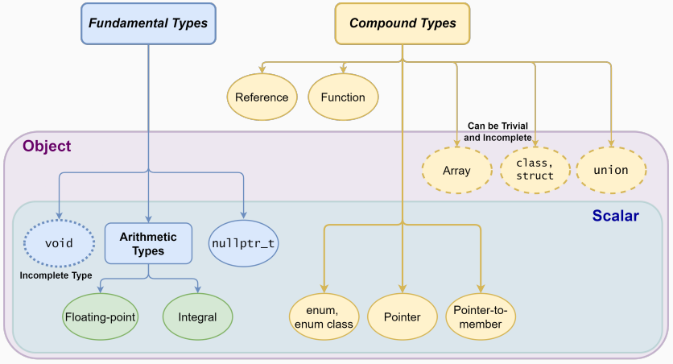

# 基本概念

c++, 不得不学，但有句话说的好: Every second spent trying to understand the language is one not spent understanding the problem.

一个C++程序由特定于语言的关键字（`keywords`, 如for、if、new、true 等）、标识符（`identifiers`, 用于变量 variables、函数 functions、结构体 structures、命名空间 namespaces 等的符号）、表达式（`expressions` 定义为操作符的序列）以及字面量（`literals` 常量值令牌）组成。

* 实体 (`entity`) 是一个值 value、对象 object、引用 reference、函数 function、枚举器 enumerator、类型 type、类成员 class member 或模板 tempalte。
	* 标识符和用户定义的操作符是用来指代实体的名称。
	* 实体也包括表达式的结果。
	* 预处理器宏不是 C++ 的实体。

* 声明/原型 (declaration/prototype)
	* 声明（或原型）是引入一个带有标识符的实体，描述其类型和属性。声明是编译器和链接器需要的，以接受对该标识符的引用（使用）。
	* 实体可以被多次声明，所有的声明都必须保持相同。

* 定义/实现 (definition/implementation)
	* 实体的定义是声明的实现。它定义了实体的属性和行为。对于每个实体，只允许有一个单一的定义。

```cpp
struct A; // declaration 1
struct A; // declaration 2 (ok)
struct B { // declaration and definition
int b;
// A x; // compile error incomplete type
A* y; // ok, pointer to incomplete type
};
struct A { // definition
char c;
}
```

## 编译器

```bash
g++ -std=c++11 <program.cpp> -o program
g++ -std=c++14 <program.cpp> -o program 
g++ -std=c++17 <program.cpp> -o program 
g++ -std=c++20 <program.cpp> -o program 
g++ -std=c++23 <program.cpp> -o program 
g++ -std=c++26 <program.cpp> -o program
```

| Compiler | C++11 |  | C++14 |  | C++17 |  | C++20 |  |
| :--- | :---: | :---: | :---: | :---: | :---: | :---: | :---: | :---: |
|  | Core | Library | Core | Library | Core | Library | Core | Library |
| g++ | 4.8 .1 | 5.1 | 5.1 | 5.1 | 7.1 | 9.0 | 11+ | 11+ |
| clang++ | 3.3 | 3.3 | 3.4 | 3.5 | 5.0 | 11.0 | 16+ | 16+ |
| MSVC | 19.0 | 19.0 | 19.10 | 19.0 | 19.15 | 19.15 | 19.29+ | 19.29 |


## 类型

### 基本概念

* c++ 是强类型 (strong typed) 和静态类型 (statically typed) 的语言
	* **每个实体 (entity, 包括 variable, function, expression, 以及用户自定义的 struct, class) 都有一个类型，并且该类型永不改变**
	* 类型指定了
		* 有多少**内存分配**给变量或表达式的结果
		* 存储值的类型，例如整数、浮点数、字符等；以及编译器如何解释这些值的位模式 (bit pattern)，例如，如果编译器看到一个位模式 `01000001`，根据上下文，它可能会将其解释为整数 `65`，或者 ASCII 编码中的字符 `'A'`。
		* 这些**实体允许的操作**，例如，对于整数，可以执行加、减、乘、除等算术运算；对于字符串，可以执行拼接、分割、查找等操作。类型还会提供语义 (semantics)，例如，对于整数，可以执行加、减、乘、除等算术运算；对于字符串，可以执行拼接、分割、查找等操作。

* c++ 的类型分类
	* 基础类型 (Fundamental types), 即由 c++ 语言本身自带的类型, 比如算数类型, int, float, 还有 void, `nullptr`
	* 复合类型 (Compound types), 是其它类型的组合或引用
		* Pointers 
		* References
		* Enumerators
		* Arrays
		* struct , class , union
		* Functions

* c++ 类型的性质 (properties)
	* 大小 (size), 可以用 `sizeof` 查询
	* 对齐要求 (alignment requirement), 可以用 `alignof` 查询。对齐要求是指变量相对于内存开始位置的偏移量必须是某个数（称为对齐值）的倍数，通常与该类型最大的成员的大小相同
	* 存储期限 (storage duration), 描述对象何时被分配和释放
	* 生命周期 (lifetime), bounded by storage duration or temporary
	* 值 (value)，对于某些类型的对象，如未初始化的局部变量，其值可能是不确定的，这意味着值在程序中是未定义的，可能导致不可预测的行为
	* 名称 (name)，并非所有对象都有名称, 比如 `someFunction(MyClass(5));` 中的 `MyClass(5)` 就是匿名对象


* 一些形容 c++ 类型的方式
	* 标量 (scalar)。
		* 每个实例仅持有一个单一的数据值，且不包含或由其他对象组成。这与复合类型（如结构体或类）形成对比，后者可以包含多个不同类型的成员。
		* 可以逐位复制（Trivially Copyable）：标量类型的对象可以通过简单的内存复制操作来复制，不需要复杂的复制逻辑
		* 标准布局（Standard Layout）：标量类型具有与 C 语言兼容的内存布局。这使得它们能够与用 C 语言编写的代码交互，例如可以直接在 C++ 程序中使用 C 语言库或函数。
		* 隐式生命周期（Implicit Lifetime）：标量类型通常没有用户定义的构造函数或析构函数。它们的创建和销毁是自动进行的，不涉及任何复杂的生命周期管理。
	* 未完成类型 (incomplete types), (比如表示没有数据的 `void`)
		* 指的是已被声明但尚未定义的类型。这种类型的声明提供了足够的信息用于指向该类型的指针和引用，但不足以创建该类型的实例，因为其内存布局和大小尚未确定
		* 未完成类型通常在代码中先被声明，其具体的定义可能出现在后续的代码中，或者在另一个文件中
		* 用途: 前向声明
		* 例子
			```c++
			struct B; // 前向声明，此时 B 是一个未完成类型

			B* arr[10]; // 正确，因为是指针数组
			B arr2[10]; // 错误，因为 B 未定义，无法确定数组大小
			struct B { int x; double y; }; // 完整定义，现在 B 的大小和布局已知
			```





### 基础类型 (fundamental types)

* integral

| Native Type | Bytes | Range | Fixed width types `<cstdint>` |
| :---: | :---: | :---: | :---: |
| bool | 1 | true, false |  |
| $\operatorname{char}^{\dagger}$ | 1 | implementation defined |  |
| signed char | 1 | -128 to 127 | int8_t |
| unsigned char | 1 | 0 to 255 | uint8_t |
| short | 2 | $-2^{15}$ to $2^{15}-1$ | int16_t |
| unsigned short | 2 | 0 to $2^{16}-1$ | uint16_t |
| int | 4 | $-2^{31}$ to $2^{31}-1$ | int32_t |
| unsigned int | 4 | 0 to $2^{32}-1$ | uint32_t |
| long int | $4 / 8$ |  | int32_t/int64_t |
| long unsigned int | $4 / 8^*$ |  | uint32_t/uint64_t |
| long long int | 8 | $-2^{63}$ to $2^{63}-1$ | int64_t |
| long long unsigned int | 8 | 0 to $2^{64}-1$ | uint64_t |


注: \* 4 bytes on Windows64 systems, $\dagger$ signed/unsigned, two-complement from C++11 (二进制补码（Two's complement）是一种整数的二进制表示方法，广泛用于表示有符号整数。在二进制补码表示中，正数的表示与其无符号形式相同（符号位为 0），而负数是通过取其正数值的二进制反码（所有二进制位取反）然后加一得到的。)

查询大小:

```cpp
# include <limits>
std::numeric_limits<int>::max(); // 2^31 − 1
std::numeric_limits<uint16_t>::max(); // 65,535
std::numeric_limits<int>::min(); // −2^31
std::numeric_limits<unsigned>::min(); // 0
```


* float


| Native Type | IEEE | Bytes | Range | Fixed width types |
| :---: | :---: | :---: | :---: | :---: |
|             |      |       |       | C++23 `<stdfloat>` |
| (bfloat16)  | N    | 2     | $\pm 1.18 \times 10^{-38}$ to $\pm 3.4 \times 10^{+38}$ | std::bfloat16_t |
| (float16)   | Y    | 2     | 0.00006 to 65,536 | std::float16_t |
| float       | Y    | 4     | $\pm 1.18 \times 10^{-38}$ to $\pm 3.4 \times 10^{+38}$ | std::float32_t |
| double      | Y    | 8     | $\pm 2.23 \times 10^{-308}$ to $\pm 1.8 \times 10^{+308}$ | std::float64_t |

`float` 类型的机器精度是 $10^{-7}$, `double` 是 $10^{-16}$

```cpp
# include <limits>
// T: float or double
std::numeric_limits<T>::max(); // largest value
std::numeric_limits<T>::lowest(); // lowest value (C++11)
std::numeric_limits<T>::min(); // smallest value
std::numeric_limits<T>::denorm min() // smallest (denormal) value
std::numeric_limits<T>::epsilon(); // epsilon value
std::numeric_limits<T>::infinity() // infinity
std::numeric_limits<T>::quiet NaN() // NaN
```

```cpp
# include <cmath> // C++11
bool std::isnan(T value) // check if value is NaN
bool std::isinf(T value) // check if value is ±infinity
bool std::isfinite(T value) // check if value is not NaN
// and not ±infinity
bool std::isnormal(T value); // check if value is Normal
T std::ldexp(T x, p) // exponent shift x  2p
int std::ilogb(T value) // extracts the exponent of value
```


* 缩写

| Signed Type | short name |
| :--- | :--- |
| signed char | $/$ |
| signed short int | short |
| signed int | int |
| signed long int | long |
| signed long long int | long long |


| Unsigned Type | short name |
| :--- | :--- |
| unsigned char | $/$ |
| unsigned short int | unsigned short |
| unsigned int | unsigned |
| unsigned long int | unsigned long |
| unsigned long long int | unsigned long long |


* 后缀 (suffix)

| Type | SUFFIX | Example | Notes |
| :--- | ---: | ---: | :--- |
| int | $/$ | 2 |  |
| unsigned int | u, U | 3u |  |
| long int | l, L | 8L |  |
| long unsigned | ul, UL | 2ul |  |
| long long int | ll, LL | 4ll |  |
| long long unsigned int | ull, ULL | 7ULL |  |
| float | f,F | 3.0f | only decimal numbers |
| double |  | 3.0 | only decimal numbers |


| C++23 Type | SUFFIX | Example | Notes |
| :---: | :---: | :---: | :---: |
| std::bfloat16_t | bf16, BF16 | 3.0bf16 | only decimal numbers |
| std::float16_t | f16, F16 | 3.0f16 | only decimal numbers |
| std::float32_t | f32, F32 | 3.0f32 | only decimal numbers |
| std::float64_t | f64, F64 | 3.0f64 | only decimal numbers |
| std::float128_t | f128, F128 | 3.0f128 | only decimal numbers |


* 前缀 (prefix)

| Representation | PREFIX | Example |
| :--- | ---: | ---: |
| Binary C ++14 | Ob | 0b010101 |
| Octal | 0 | 0307 |
| Hexadecimal | 0x or 0X | 0xFFA010 |

C++14 also allows digit separators for improving the readability `1'000'000`


### 类型转换

$\otimes$: any operation (*, +, /, -, %, etc.)

* Floating Point Promotion
	- floating type $\otimes$ integer type $\rightarrow$ floating type
* Implicit Integer Promotion
	* Rule: small integral type $\otimes$ small integral type $\rightarrow$ int
	* 当两个小于`int`类型的整数进行运算时，它们会被隐式提升为`int`类型，以确保有足够的位宽处理可能的数值扩展
* Size Promotion
	* Rule: small type $\otimes$ large type $\rightarrow$ large type
*  Sign Promotion
	* Rule: signed type $\otimes$ unsigned type $\rightarrow$ unsigned type
  - 当有符号类型和无符号类型一起运算时，为避免负值的意外产生，有符号类型会被转换为相应的无符号类型。这种转换是因为无符号类型有更宽的正数范围，而编译器尝试保证数值不会因为类型转换而变成负数。此时有符号的负数，比如 -2, 会转换为很大的无符号正数。

```c++
float f = 1.0f; 
unsigned u = 2; 
int i = 3; 
short s = 4; 
uint8_t c = 5; // unsigned char 
f * u; // float × unsigned → float: 2.0f 
s * c; // short × unsigned char → int: 20 
u * i; // unsigned × int → unsigned: 6u 
+c; // unsigned char → int: 5
```
**注意，int 参与的计算，还是会取整!**
```cpp
int b = 7; 
float a = b / 2; // a = 3 not 3.5!! 
int c = b / 2.0; // again c = 3 not 3.5!!
```

### auto

```cpp
auto a = 1 + 2; // 1 is int, 2 is int, 1 + 2 is int! 
// -> 'a' is "int" 
auto b = 1 + 2.0; // 1 is int, 2.0 is double. 1 + 2.0 is double 
// -> 'b' is "double"
```

```cpp
auto g(int x) -> int { return x * 2; } // C++11
// "-> int" is the deduction type
// a better way to express it is:
auto g2(int x) -> decltype(x * 2) { return x * 2; } // C++11
// `decltype` 用于推导表达式的类型
auto h(int x) { return x * 2; } // C++14
//--------------------------------------------------------------
int x = g(3); // C++11
```


### Enumerator - `enum`

在 C++ 中，枚举（enum）是一种数据类型，它将一组命名的整数常量 分组在一起。以下是一个使用和问题分析的例子，可以直接复制到你的 Markdown 笔记中：


## 操作符 (operator)

| Precedence | Operator | Description | Associativity |
| :---: | :---: | :---: | :---: |
| 1 | a++  $\quad$  a\-\- | Suffix/postfix increment and decrement | Left-to-right |
| 2 | +a $\quad$ -a $\quad$ ++a $\quad$ --a $\quad$ ! $\quad$ not $\quad$ ~ | Plus/minus, Prefix increment/decrement, <br> Logical/Bitwise Not | Right-to-left |
| 3 | a*b $\quad$ a/b $\quad$ a%b | Multiplication, division, and remainder | Left-to-right |
| 4 | a+b $\quad$ a-b | Addition and subtraction | Left-to-right |
| 5 | << $\quad$ >> | Bitwise left shift and right shift | Left-to-right |
| 6 | < $\quad$ <= $\quad$ > $\quad$ >=  | Relational operators | Left-to-right |
| 7 |== != | Equality operators | Left-to-right |
| 8 | & | Bitwise AND | Left-to-right |
| 9 | ^ | Bitwise XOR | Left-to-right |
| 10 | \| | Bitwise OR | Left-to-right |
| 11 | && and | Logical AND | Left-to-right |
| 12 | \|\| or | Logical OR | Left-to-right |
| 13 | += -= *= /= %= <<= >>= &= ^= \|= | Compound | Right-to-left |


* The comma operator has left-to-right associativity. It evaluates the left expression, discards its result, and returns the right expression

```cpp
int a = 5, b = 7;
 int x = (3, 4); // discards 3, then x=4 
 int y = 0; 
 int z; 
 z = y, x; // z=y (0), then returns x (4)
```


<!--stackedit_data:
eyJoaXN0b3J5IjpbNjI3MTA3MTksMTMxODE0MTUxMSwxNjYwMT
QxNzQzLC04NDU4NTAyODUsMTAzNTAwOTY3OCwxNDc2MTc4MDAw
LC0xMjM4NTcwMDExLC0yMTAyNTk5NTAxLC0xNjQ4OTc2NDQwLD
k2MDA5NDU5OCwtMTUwODEyNTg4MCwyMDIxMzAxMjI5LC02NzI3
MDQwMjAsLTMxMjI5MjU0OCwtMTYzNTk5MzI1MiwtMTQxMjM1Nj
U4OCwtMTE5OTI2Mzg3Niw5NDA3NzY4ODAsLTQ0MzI3OTkwNywt
MTE4MzQ3NzUyOF19
-->