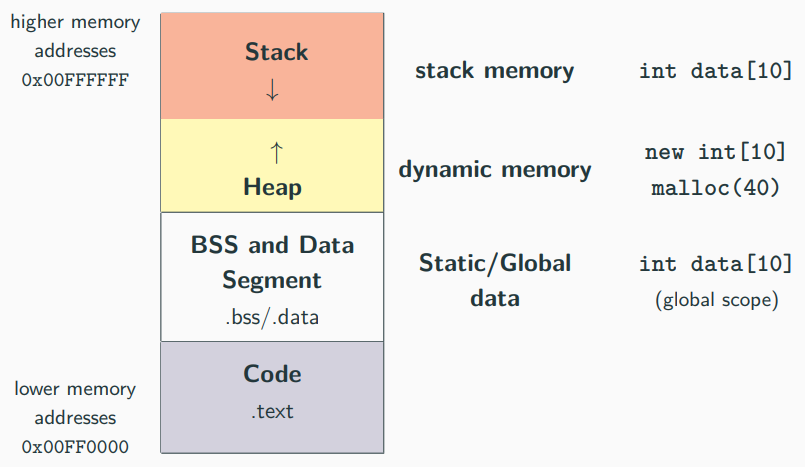

# 指针

## stack and heap


{width=600px}

Data/BSS (Block Started by Symbol) segments are larger than stack memory (max ≈ 1GB in general) but slower

|  | Stack | Heap |
| :---: | :---: | :---: |
| Memory <br> Organization | Contiguous (LIFO) | Contiguous within an allocation, <br> Fragmented between allocations <br> (relies on virtual memory) |
| Max size | Small (8MB on Linux, 1MB on <br> Windows) | Whole system memory |
| If exceed | Program crash at function <br> entry (hard to debug) | Exception or nullptr |
| Allocation | Compile-time | Run-time |
| Locality | High | Low |
| Thread View | Each thread has its own stack | Shared among threads |

### stack

```cpp
int x = 3; // not on the stack (data segment)
struct A {
int k; // depends on where the instance of A is
};
int main() {
int y = 3; // on stack
char z[] = "abc"; // on stack
A a; // on stack (also k)
void* ptr = malloc(4); // variable "ptr" is on the stack
}
```

* 在 `stack` 上的 data:
	* 局部变量 (local variable)
	* 函数参数 (Function arguments)
	* 编译器临时变量 (Compiler temporaries)
	* 中断上下文 (Interrupt contexts)

注意: **存储在栈 (stack) 中的每个对象在其作用域之外都是无效的！**

```cpp
int* f() {
int array[3] = {1, 2, 3};
return array;
}
int* ptr = f();
cout << ptr[0]; // Illegal memory access!! 
```

```cpp
void g(bool x) {
const char* str = "abc";
if (x) {
char xyz[] = "xyz";
str = xyz;
}
cout << str; // if "x" is true, then Illegal memory access!! 
}
```


### heap

学习堆 (heap) 的用法，关键是掌握 `new` 和 `delete`。注意，用到 `new`/`new[]` ，就必须有对应的 `delete`/`delete[]`；用到 `malloc`，就必须用 `free` 。

`new`/`new[]` 和 `delete`/`delete[]` 是 C++ 的关键字，它们在运行时执行动态内存分配/释放以及对象的构造/析构。

`malloc` 和 `free` 是 C 语言中的函数，它们只负责分配和释放内存块（以字节为单位）, 不涉及调用对象的构造函数和析构函数。同时，`new` 返回确切的数据类型，而 `malloc()` 返回 `void*`


`new` 和 `delete` 的优点:
1. 是语言的关键字，而不是函数。这意味着它们是语言的一部分，可以提供比 C 语言中的库函数 `malloc` 和 `free` 更安全的错误处理和类型安全。
2. `new` 直接返回对象的确切类型的指针，无需类型转换。 相比之下，`malloc` 返回一个 `void*` 类型的指针，使用时通常需要转换到适当的类型，这增加了出错的风险。
3. 当内存分配失败时，`new` 会抛出一个异常（`std::bad_alloc`），这迫使开发者处理这种情况，避免了忽视错误的可能。 `malloc` 在分配失败时返回 `NULL`，需要开发者显式检查返回值以确认是否成功，这容易被忽略。
4. 使用 `new` 时，编译器自动计算所需的内存大小，用户不需要关心。使用 `malloc` 时，必须手动计算并指定需要分配的字节数，这不仅繁琐，也容易出错。
5. `new` 不仅用于内存分配，还可以在分配内存时初始化对象。例如，`new int(5)` 会分配一个整数并初始化为 5。`malloc` 只负责内存分配，不进行任何初始化。
6. 在 C++ 中，使用 `new` 分配具有虚函数的对象时，会自动设置虚拟表指针（vptr），确保对象的多态性正常工作。`malloc` 由于只是简单地分配内存，无法处理虚拟表的初始化，因此不能用于需要支持多态性的对象。

分配单一元素
```cpp
int* value = (int*) malloc(sizeof(int)); // C
int* value = new int; // C++
```

分配 N 个元素
```cpp
int* array = (int*) malloc(N * sizeof(int)); // C
int* array = new int[N]; // C++
```

分配 N  个 `struct`
```cpp
MyStruct* array = (MyStruct*) malloc(N * sizeof(MyStruct)); // C
MyStruct* array = new MyStruct[N]; // C++
```

分配并 zero-initialize N 个元素
```cpp
int* array = (int*) calloc(N, sizeof(int)); // C
int* array = new int[N](); // C++
```

释放单个元素
```cpp
int* value = (int*) malloc(sizeof(int)); // C
free(value);
int* value = new int; // C++
delete value;
```

释放 N 个元素
```cpp
int* value = (int*) malloc(N * sizeof(int)); // C
free(value);
int* value = new int[N]; // C++
delete[] value;
```
2D 数组的分配
```cpp
int** A = new int*[3]; // array of pointers allocation
for (int i = 0; i < 3; i++)
	A[i] = new int[4]; // inner array allocations
for (int i = 0; i < 3; i++)
	delete[] A[i]; // inner array deallocations
delete[] A; // array of pointers deallocation
```
2D 数组的分配 (c++11)
```cpp
auto A = new int[3][4]; // allocate 3 objects of type int[4]
int n = 3; // dynamic value
auto B = new int[n][4]; // ok
// auto C = new int[n][n]; // compile error
delete[] A; // same for B, C
```

内存泄漏: 内存泄漏是指堆内存中已经分配出来但程序不再使用，且在整个执行过程中仍然保持分配状态的实体。


<!--stackedit_data:
eyJoaXN0b3J5IjpbMjExNjQ4OTQzNCwtOTg3MTgwOTUwLDE2Nz
c3MTUzNjAsMTY4ODQxNDQxLDc2ODg0NDQxLC00MzgyODEzMDcs
MTk4NzMyODcxMSwxMDA5ODMyMzU1LC0xNDkxNzM1MjU4LC0xMD
M4MDkyMTg3LC0xNjQxMTQxOTI1LDE2NjI4NzkxNF19
-->