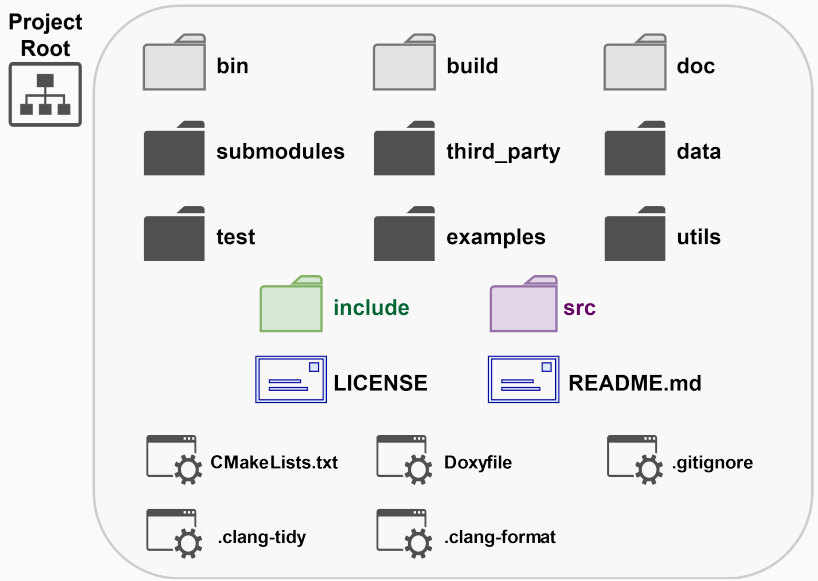
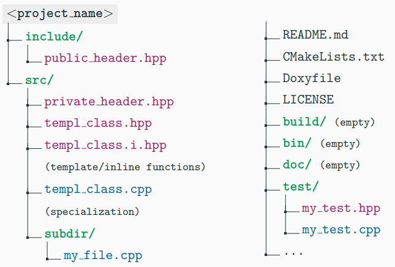

# 编程规范

## 工程组织

{width=500px}


- 基本目录：
  - `include`：项目公共头文件。
  - `src`：项目源文件和私有头文件。
  - `test` 或 `tests`：项目测试源文件。

- 空目录：
  - `bin`：输出的可执行文件。
  - `build`：所有中间文件。
  - `doc` 或 `docs`：项目文档。

- 可选目录：
  - `submodules`：项目子模块。
  - `third_party`（较少使用 deps/external/extern）：依赖或外部库。
  - `data` 或 `extras`：被可执行文件或测试使用的文件。
  - `examples`：展示项目功能的源文件。
  - `utils` 或` tools`, `script`：与项目相关的脚本和工具。
  - `cmake`：CMake子模块（.cmake 文件）。

- 文件说明：
  - `LICENSE`：描述如何使用和分发此项目。
  - `README.md`：用 Markdown 格式编写的项目的一般信息。
  - `CMakeLists.txt`：描述如何编译项目的文件。
  - `Doxyfile`：doxygen 使用的配置文件，用于生成文档。
  - 其他文件如 .gitignore, .clang-format, .clang-tidy 等。


- 选择开源许可：
  - choosealicense.com


- 常见的 C++ 文件扩展名：
  - 头文件：.h, .hh, .hpp, .hxx
  - 头文件实现：.i.h, .i.hpp, -inl.h, .inl.hpp
    - 用于内联函数和模板的接口与实现分离
    - 在头文件中保持实现“内联”
  - 源文件/实现：.c, .cc, .cpp, .cxx
  - 命名约定：
    - .h, .c, .cc：Google 使用
    - .hh, .cc
    - .hpp, .cpp
    - .hxx, .cxx

- 文件命名：
  - 文件应该以其实现的类/命名空间的名称命名。
  - 例如：
    - 类 MyClass: MyClass.hpp, MyClass.i.hpp, MyClass.cpp
    - 命名空间 my_np: MyNP.hpp, MyNP.i.hpp, MyNP.cpp

- 源码组织：
  - 公共头文件放在 include/ 目录。
  - 源文件、私有头文件、头文件实现放在 src/ 目录。
  - 主文件（如果存在）放在 src/ 并命名为 main.cpp。
  - 代码测试，单元测试和功能测试放在 test/，或者单元测试放在被测试组件同一目录下，文件名以 `.test` 后缀，例如 my_file.test.cpp。

{width=500px}


* 典范:
	* https://github.com/TheLartians/ModernCppStarter


## include


- 每个 include 必须是自给自足的：
  - 直接包含你需要的每个头文件。
  - 不依赖于递归的 #include。
  - 项目必须能够以任何 include 顺序编译。

- 尽可能少地 include，特别是在头文件中：
  - 不要包含不需要的头文件。
  - 尽量减少依赖。
  - 尽量减少头文件中的代码（例如使用前向声明）。

- #include 的顺序 LLVM, WebKit, Core：
  1. 如果存在，主模块/接口头文件（只有一个）。
  2. 本地项目 includes（按字典顺序）。
  3. 系统 includes（按字典顺序）。
     - 注意：(2) 和 (3) 可以互换 Google
  - 系统 includes 是自给自足的，本地 includes 可能不是。

- 项目 includes LLVM, Google, WebKit, Hic, Core：
  - 使用 "" 语法。
  - 应该是从项目 include 根目录开始的绝对路径。
    - 例如：#include "directory1/header.hpp"

- 系统 includes ：
  - 使用 <> 语法。
    - 例如：#include <iostream>

- 总是使用 include 保护：
  - 宏 include 保护与 #pragma once
    - 如果可移植性是非常强的要求，则使用宏 include 保护。
    - 否则使用 #pragma once。
  - #include 预处理器应该紧接在头文件注释和 include 保护之后放置。

- 前向声明与 #includes：
  - 优先考虑前向声明：减少编译时间，减少依赖。
  - 优先考虑 #include：更安全。

- 使用 C++ 头文件而不是 C 头文件：
  - <cassert> 而不是 <assert.h>
  - <cmath> 而不是 <math.h> 等。
  - 为每个 include 报告至少一个使用的函数：
    - #include <iostream> // std::cout, std::cin
    - #include "my_class.hpp" // MyClass
    - #include "my_dir/my_headerA.hpp" // npA::ClassA, npB::f2()
    - #include "my_dir/my_headerB.hpp" // np::g()
    - #include <cmath> // std::fabs()
    - #include <vector> // std::vector


## 宏和预处理

- 避免在头文件中定义宏：
  - 不要使用宏定义枚举、常量和函数。

- 为所有与项目相关的宏使用前缀 `MYPROJECT_MACRO`：

- 尽可能取消定义宏 #undef macros：
  - 即使在源文件中也是如此，如果使用统一构建（合并多个源文件以提高编译时间）。

- 对于多行宏，始终使用大括号：
  ```c
  # define MACRO \
  { \
  line1; \
  line2; \
  }

<!--stackedit_data:
eyJoaXN0b3J5IjpbLTMxMTI4MzM2MCw0MzU4OTY0MTksMTE0NT
kyMjQ0NV19
-->