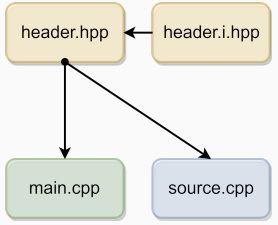

# 翻译单元

## 基本概念

区分三个概念: scope (变量在什么范围内有效)、duration (变量什么时候分配和释放)、linkage (变量对于外部翻译单元是否可见)

-   翻译单元 (translation unit) 是C++中的基本编译单位。它由**单个源文件的内容，加上该源文件直接或间接包含的任何头文件的内容组成**。一个翻译单元可以被编译成对象文件、库文件或可执行程序。

-   Header File（头文件）。头文件允许**定义接口** (interface)，文件扩展名通常为 `.h`、`.hpp` 或 `.hxx`。它们用于声明函数、类以及其他类型的接口，而具体的实现则保留在分离的源文件中。
    
-   Source File（源文件）。源文件包含具体的实现代码，文件扩展名可能为 `.c`、`.cpp` 或 `.cxx`。源文件中包含从头文件中引入的声明的具体实现。

* 一个典型的编译过程:


* Scope（作用域），是指在代码中可以访问变量、函数或对象的区域。


-   Local Scope / Block Scope（局部作用域 / 块作用域），在函数或代码块内声明的实体称为局部变量。它们只在声明它们的函数或代码块内有效，其内存地址在作用域之外无效。


-   Global Scope / File Scope / Namespace Scope（全局作用域 / 文件作用域 / 命名空间作用域）: 在所有函数外部定义的实体。这些实体在程序的整个生命周期内保持单一的内存位置。

```cpp
int var1; // global scope
int f() {
	int var2; // local scope
}
struct A {
	int var3; // depends on where the instance of 'A' is used
};
```


-   Linkage（链接） 。 链接是指符号对链接器的可见性 (visibility)。

-   No Linkage（无链接）：无链接是指局部作用域内的符号，对链接器不可见。
	- 局部的变量、局部的函数、局部的类在定义它们的作用域内有效，不可在其他翻译单元中访问。
	- 静态局部变量（static local variable）的地址取决于其所在函数的链接性。

-   Internal Linkage（内部链接）。内部链接是指只在单个翻译单元的作用域内可见的符号。相同的符号名称在不同翻译单元中具有不同的内存地址。
	- 在其他翻译单元中不可访问，避免了名称冲突，各自有不同的内存地址。
	- 全局变量：
		 - 使用`static`修饰符。
		 - 常量（const）、常量表达式（constexpr）（非内联（inline）、非模板（template）、非特化（specialized）、非外部（extern））。
	- 函数：
		 - 使用`static`修饰符。
		- 匿名命名空间 (anonymous `namespace`) 的内容，包括结构体和类。


-   External Linkage（外部链接）。外部链接是指存在于单个翻译单元之外的实体。这些实体在整个程序中可访问，并且在所有翻译单元的组合中具有相同的内存地址。
	- 可以被其他翻译单元访问，可能会产生名称冲突，具有相同的内存地址。
	- 全局变量：
	  - 无修饰符或使用`extern`修饰符。
	  - 模板/特化（C++14）（模板变量按一次定义规则（ODR）处理，不会冲突）。
	  - C++17起，内联的常量（inline const）/常量表达式（constexpr）（按ODR处理，不会冲突）。
	- 函数：
	  - 无修饰符，或使用`extern`修饰符。
	  - 模板/特化 (`template/specialized`)。
	  - 注意：内联函数（inline）、常量表达式函数（constexpr，暗示内联）即使具有外部链接性，也不可在其他翻译单元中访问。
	- 枚举类型、类及其静态和非静态成员。

## 存储类别与期限 (storage class and duration)


-   Storage Duration（存储期限）。存储期限（或称持续性类别, duration class）决定了一个变量的生命周期，即变量何时被创建和销毁。


-   Automatic Storage Duration（自动存储期限） 。局部变量临时分配在寄存器或栈上（取决于编译器、架构等）。如果没有明确初始化，它们的值是未定义的。

-   Static Storage Duration（静态存储期限）。当程序开始时分配对象的存储空间，程序结束时释放。如果没有明确初始化，它将进行零初始化。


-   Dynamic Storage Duration（动态存储期限）。对象的分配和释放通过使用动态内存分配函数（如 `new`/`delete`）进行。如果没有明确初始化，其内存内容是未定义的。


-   (C++11) Thread Storage Duration（线程存储期限）。对象在线程开始时分配，在线程结束时释放。每个线程拥有对象的自己的实例。

| Storage Duration | Allocation | Deallocation |
| :--- | :--- | :--- |
| Automatic | Code block start | Code block end |
| Static | Program start | Program end |
| Dynamic | Memory allocation | Memory deallocation |
| Thread | Thread start | Thread end |


```cpp
int v1; // static duration
void f() {
    int v2; // automatic duration
    auto v3 = 3; // automatic duration
    auto array = new int[10]; // dynamic duration (allocation)
} // array, v2, v3 variables deallocation (from stack)
// the memory associated to "array" is not deallocated
int main() {
    f();
}
// main end: v1 is deallocated
```


* Storage Class Specifier（存储类说明符）: 存储类说明符是一种类型说明符，与作用域一起，决定了变量的存储期限和链接方式。

| Storage Class | Notes | Scope | Storage Duration | Linkage |
| :--- | :--- | :--- | :--- | :--- |
| auto | local var decl. | Local | automatic | No linkage |
| no storage class | global var decl. | Global | static | External |
| static |  | Local | static | Function |
| static |  | Global | static | Dependent |
| extern |  | Global | static | External |
| thread_local | C ++11 | any | thread local | any |


```cpp
int v1; // no storage class
static int v2 = 2; // static storage class
extern int v3; // external storage class
thread_local int v4; // thread local storage class
thread_local static int v5; // thread local and static storage classes
int main() {
    int v6; // auto storage class
    auto v7 = 3; // auto storage class
    static int v8; // static storage class
    thread_local int v9; // thread local and auto storage classes
    auto array = new int[10]; // auto storage class ("array" variable)
}
```

* `static` 类型的局部变量在程序开始运行时分配，当函数第一次执行时初始化，在程序结束时释放。
```cpp
int f() {
    static int val = 1;
    val++;
    return val;
}
int main() {
    cout << f(); // print 2 ("val" is initialized)
    cout << f(); // print 3
    cout << f(); // print 4
}
```

- `static` / 匿名 (anonymous) 命名空间中的全局变量或函数仅在所在文件中可见，具有内部链接性（internal linkage）。
- 非`static`的全局变量或函数若在不同的翻译单元中具有相同的名称，则会产生名称冲突（name collision）。
- `extern` 关键字用于声明另一个翻译单元中存在的全局变量或函数，表示具有外部链接性（external linkage）。
  - **变量必须在某个翻译单元中定义一次且仅一次**。
  - 对于函数而言，使用 `extern` 是多余的。
  - 对于变量而言，使用 `extern` 是必要的，以防止编译器在当前翻译单元中分配内存地址。

如果同一个标识符在一个翻译单元中同时具有内部链接性和外部链接性，其行为是未定义的（undefined behavior）。

示例代码：

```c++
int var1 = 3; // 外部链接性 (与其他翻译单元中同名变量冲突)
static int var2 = 4; // 内部链接性 (仅在当前翻译单元中可见)
extern int var3; // 外部链接性 (在另一个翻译单元中实现)
void f1() {} // 外部链接性 (可能会与其他单元冲突)
static void f2() {} // 内部链接性
namespace { // 匿名命名空间
    void f3() {} // 内部链接性
}
extern void f4(); // 外部链接性 (在另一个翻译单元中实现)
```


## `const` 与 `constexpr` 变量的链接

- `const`变量在全局作用域具有内部链接性（internal linkage）。
- `constexpr`变量隐含为`const`，也具有内部链接性。
- 注意：同一个变量在不同的翻译单元中拥有不同的内存地址，这可能导致代码膨胀（code bloat）。


```c++
const int var1 = 3; // 内部链接性
constexpr int var2 = 2; // 内部链接性
static const int var3 = 3; // 内部链接性（冗余）
static constexpr int var4 = 2; // 内部链接性（冗余）
int main() {}
```


在C++中，全局变量在运行时的初始化顺序是未定义的。这可能引起一个称为“静态初始化顺序问题”（static initialization order fiasco）的问题，这种问题发生在全局变量跨多个文件时，其初始化顺序取决于链接器的链接顺序，可能导致不可预知的行为。

示例代码解释：

- source.cpp
```c++
  int f() { return 3; } // 运行时函数
  int x = f(); // 运行时评估
```
* main.cpp
```cpp
extern int x;
int y = x; // 运行时初始化
int main() {
    cout << y; // 根据链接顺序，可能打印 "3" 或 "0"
}
```

在这种情况下，如果`main.cpp`在`source.cpp`之前被初始化，则`y`可能未正确初始化而是打印“0”。


## 多个翻译单元

* 代码结构  1
	- 一个头文件，两个源文件 → 两个翻译单元（translation units）
	-  头文件被两个源文件包含。


* 代码结构 2
	- 两个头文件，两个源文件 → 两个翻译单元： 
	-  一个头文件用于声明（.hpp），另一个用于实现（.i.hpp）。
	-  声明头文件和实现头文件都被两个翻译单元包含。 
	- 分离头文件的声明和实现不是必需的，但这样做可以更好地组织代码。




## OCR (one definition rule)

1. 在任何单一翻译单元中，模板、类型、函数或对象不能有多于一个的定义：
   - 否则会导致编译器错误。
   - 允许有任意数量的声明。

2. 在整个程序中，一个对象或非内联函数不能有多于一个的定义：
   - 否则会导致多重定义的链接错误。
   - 具有内部链接性的实体即使在不同翻译单元中名称和类型相同也是允许的。

3. 模板、类型 (type) 或内联函数/变量可以在多个翻译单元中定义。对于给定的实体，每个定义必须相同：
   - 否则行为未定义 (undefined behavior)。
   - 常见情况：相同的头文件被多个翻译单元包含。
   - 链接器会从所有内联/模板实体的定义中保留一个，其他的将被移除。
   - 内联/模板实体在所有翻译单元中具有唯一的内存地址。
   - 内联/模板实体与相应未使用指定符的变量/函数具有相同的链接性。

示例代码和说明：

- header.hpp:
```cpp
  void f(); // 声明
```
- main.cpp
```cpp
#include "header.hpp"
#include <iostream>
int a = 1; // 外部链接性
// int a = 7; // 编译错误，违反第1点规则
extern int b;
static int c = 2; // 内部链接性
int main() {
    std::cout << a; // 打印 1
    std::cout << b; // 打印 5
    std::cout << c; // 打印 2
    f();
}
```

- source.cpp
```cpp
#include "header.hpp"
#include <iostream>
// 链接错误，多重定义
// int a = 2; // 违反第2点规则
int b = 5; // 正确
static int c = 4; // 内部链接性，正确
void f() { // 定义
    std::cout << b; // 打印 5
    std::cout << c; // 打印 4
}
```


关于内联（inline）关键字：
- `inline`关键字允许函数或变量（从C++17开始包括变量）在多个翻译单元中被相同地定义（而不仅仅是声明）。
- `inline`是C++中最常被误解的特性之一。
- `inline`对链接器是一个提示。没有它，链接器可能会发出“多重定义”错误。
- 内联实体不能被导出，即使它们具有外部链接性，也不能在其他翻译单元中使用（相关警告：`-Wundefined-inline`）。
- `inline`并不意味着编译器被强制执行函数内联。它仅仅提高了优化启发式阈值 (optimization heuristic threshold)。

内联功能并不总是关于性能优化；它更多是关于如何合理管理跨多个文件的代码定义。在使用`inline`时，开发者应确保在每个翻译单元中的定义保持一致，以免导致链接或运行时错误。

* `constexpr` function 隐含 `inline` 的含义
* `constexpr` variable 不隐含 `inline` 的含义
```cpp
void f1() {} // external linkage
			// potential multiple definitions error
constexpr void f2() {} // external linkage, implicitly inline
					// multiple definitions allowed
constexpr int x = 3; // internal linkage
					// different files allows distinct definitions
					// -> different addresses, code bloat
inline constexpr int y = 3; // external linkage unique memory address
						// -> potential undefined behavior
int main() {}
```

<!--stackedit_data:
eyJoaXN0b3J5IjpbNTczNjk1MzcxLDIwMTY1MjI4NDIsLTEwMj
YxNzk2MTEsLTEyMDY4NDIxMDYsLTE5MDg0NjgzMzEsNjgyNTc2
MjQ1LDQwODU4NDg5MSw3OTYzMjcxODAsMTYzODc3NDY3NywxNz
UyMjkzNzNdfQ==
-->